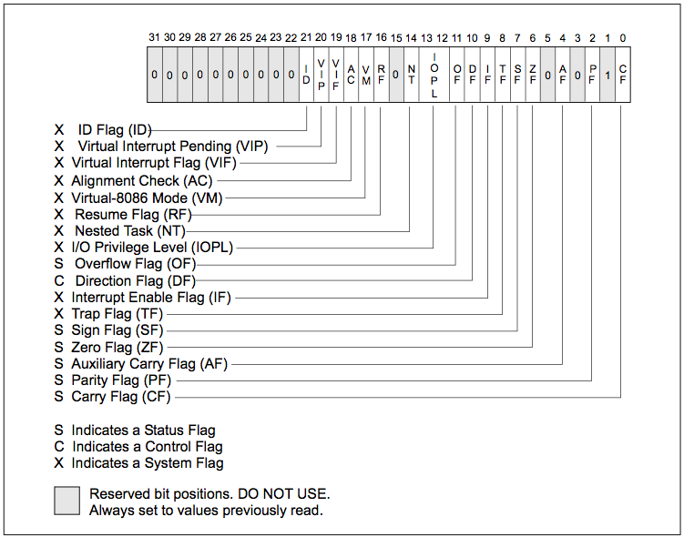

#ASM
Linux主, Windows輔

廖子慶  
2016/11/1 <!-- .element: align="right" -->

---

##Register

 <!-- .element: width="80%"-->

--

| 暫存器 |  通常作用   | 暫存器 | 通常作用  |
|  ---   |     ---     |  ---   |    ---    |
|  eax   | accumulator |  ebx   |   base    |
|  ecx   |   counter   |  edx   |   data    |
|  esi   |    index    |  edi   |   index   |
|  ebp   | stack base  |  esp   | stack top |
|  eip   |  execution  |  flag  |   state   |

--

##Flag



--

##Stack


---

#Instruction

--

###Simple

|        指令        |        作用        |      語法      |   範例    |        C++         |
|        ---         |        ---         |      ---       |    ---    |        ---         |
|      mov, lea      |       設定值       | mov dst,source | mov eax,4 |       eax=4;       |
| add, sub, mul, div |       運算值       | add dst,source | add eax,4 |      eax+=4;       |
|        push        | esp-=4; [esp]=reg; |    push reg    | push eax  |  stack.push(eax);  |
|        pop         | reg=[esp]; esp+=4; |    pop reg     |  pop eax  |  eax=stack.pop();  |
|        cmp         |     condition      |  cmp reg,val   | cmp eax,4 |   zf=eax==4?1:0;   |
|   jmp,je,jnz...    |      控制程序      |    jmp addr    | je 0x1000 | eip=zf?4096:eip+1; |

--

###More

| 指令 | 作用 | 語法 | 範例 | C++ |
|  --- |  --- |  --- |  --- | --- |
|   nop    |    xchange eax,eax    |      nop      |   nop    ||
|   ret    |        pop eip        |      ret      |   ret    | eip=stack.pop() |
|  leave   | mov esp,ebp; pop ebp; |     leave     |  leave   ||
|   call   |  push arg; push eip; jmp addr  | call function | call sh  |   function();   |
| int 0x80 |      system call      |   int 0x80    | int 0x80 ||

[Linux system call](http://docs.cs.up.ac.za/programming/asm/derick_tut/syscalls.html) <!-- .element: target="blank" -->

---

#Example

--

```x86asm
BITS 32

global _start

_start:
push 0x0068732f
push 0x6e69622f
mov ebx, esp

mov eax, 0xb
mov ecx, 0x0
mov edx, 0x0
int 0x80
```

```x86asm
BITS 32

global _start

_start:
push 0x0000000a
push 0x7579636e

mov eax,4
mov ebx,1
mov ecx,esp
mov edx,5
int 0x80

mov eax,1
int 0x80
```

--

#編譯成執行檔

```sh
nasm -f elf32 -o shell.o shell.s && ld -m elf_i386 -o shell.bin shell.o && ./shell.bin
```

--

#課堂練習

1. 輸出自己的英文名字
1. input: x, y  
output: x+y, x-y, x*y, x/y

---

Q & A

--

#END

