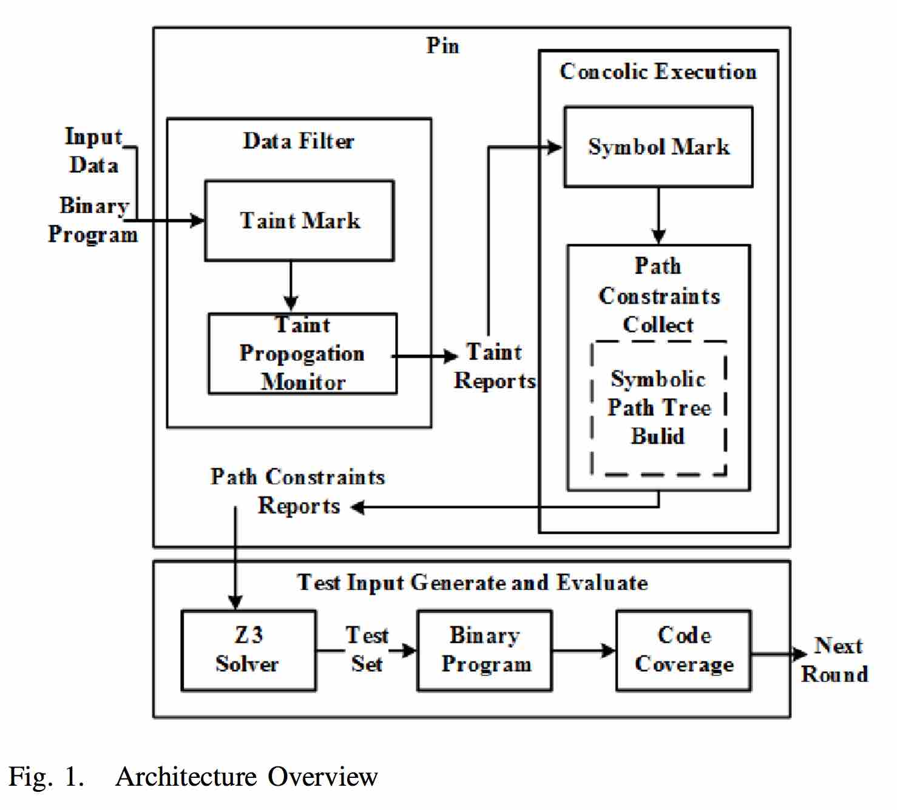
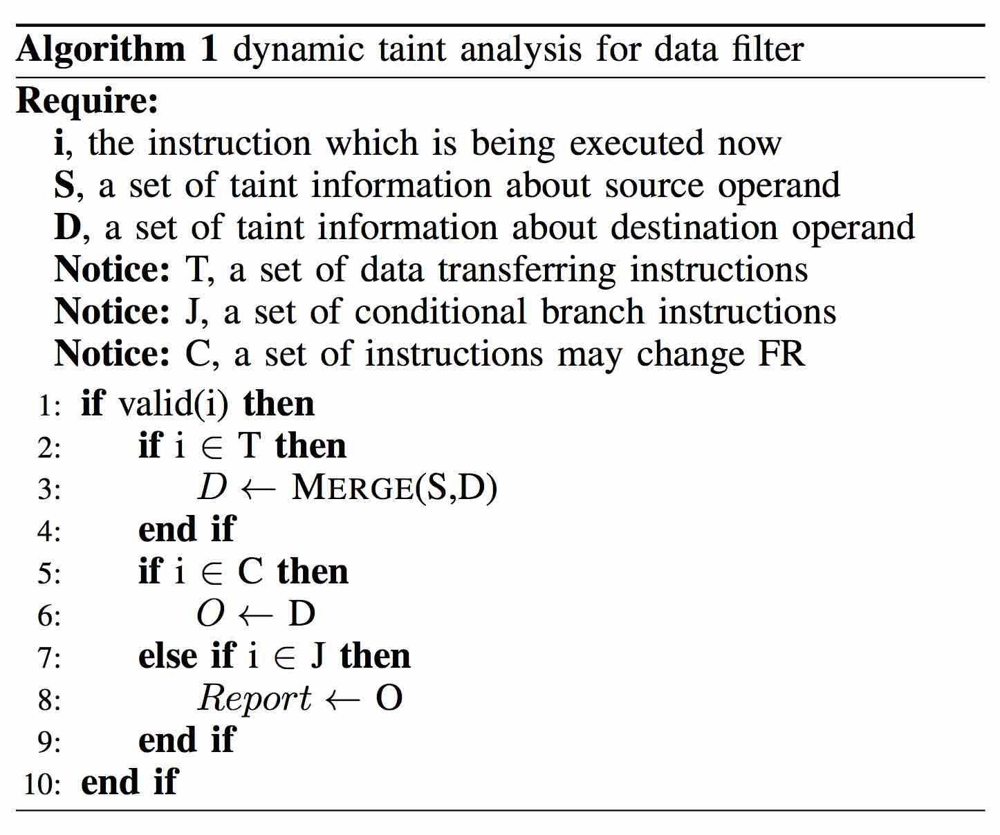
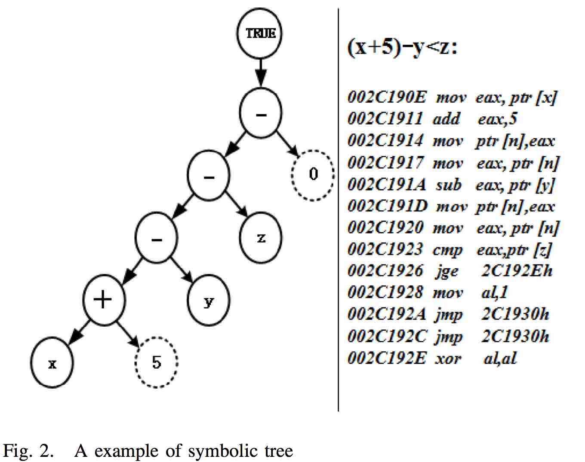
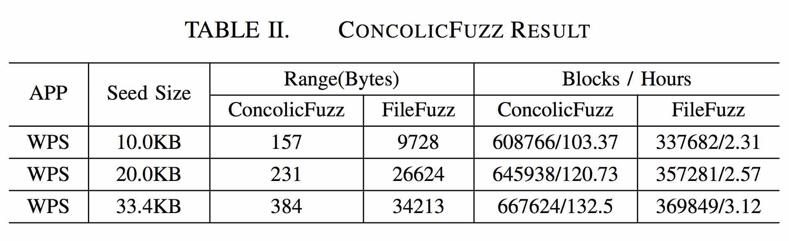
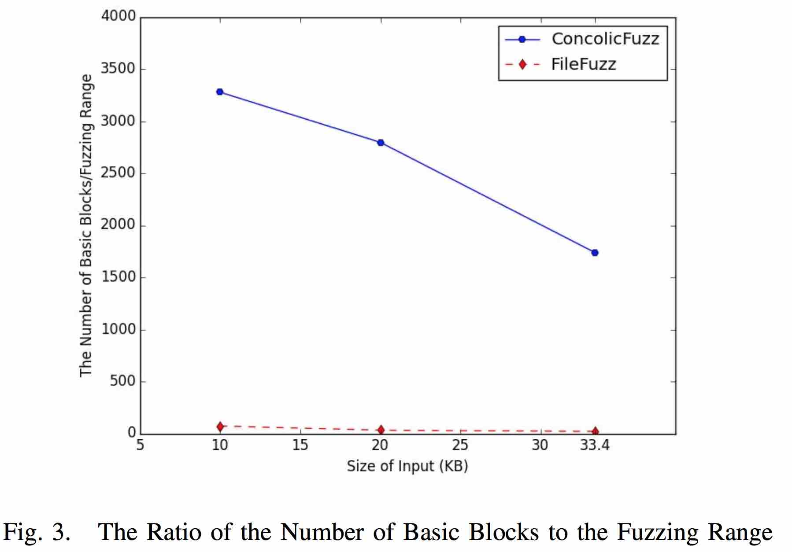
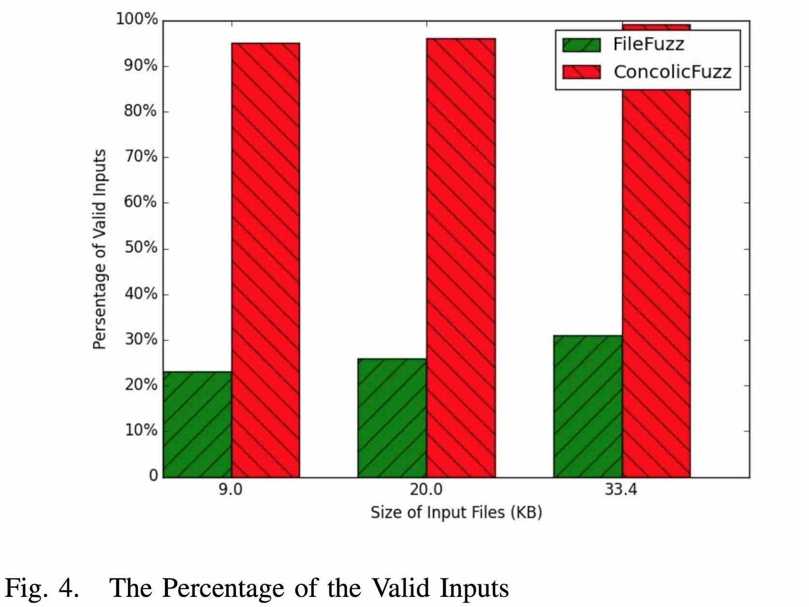
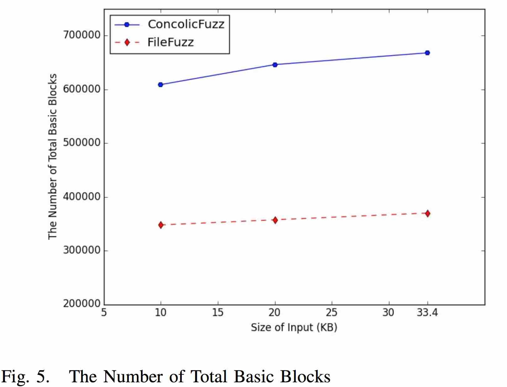
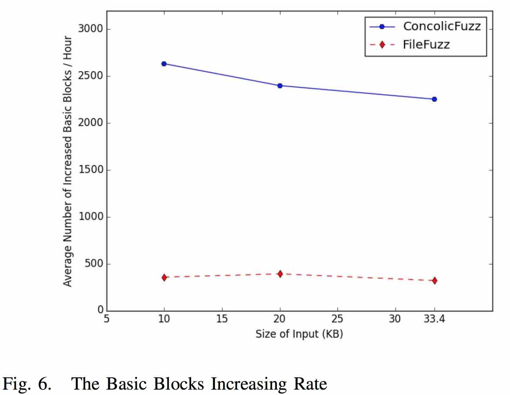

## Concolic Execute Fuzzing Based on Control-Flow Analysis

Liao Zih-Cing(DuckLL)  
2016/12/07 <!-- .element: align="right" -->

--

# Outline

1. Introduction
1. Related Work
1. Method and Techniques
1. Experiments and Comparison
1. Conclusion

---

# Introduction

1. Reduce the unnecessary analysis routine
1. Solve Fuzzing problem
    1. Malformed input
    1. Poorly performed in code coverage
1. Solve Concolic Execution problem
    1. Path explosion

--

## Light weight dynamic taint analysis

1. user input -> byte
1. instruction lead

--

## Control-flow targeted data filter

1. unexecuted path is most likely to be executed

---

# Related Work

--

## Dynamic taint analysis

user input relation

--

## Concolic execution

1. Concolic = Concrete + Symbolic
1. find bug > demonstating correctness
1. KLEE, EXE
1. Bitscope, S2E, SAGE

--

## SMT solver

1. satisfiability modulo theories
1. Z3 

---

# Method and Techniques

--

### Overview
 <!-- .element: width="75%" -->

--

## Data Filter

for each instruction that causing data transferring
 <!-- .element: width="75%" -->

--

## Concolic execution and generating fuzz test set

 <!-- .element: width="70%" -->

--

## Code Coverage Calculation and Evaluation

basic block information rate

---

# Experiments and Comparison

--

## Experiments Results

--

## Comparison

--

--

--

---

# Conclusion

1. Dynamic taint analysis (lightweight) -> small range
1. Concolic execution + SMT -> better test set
1. Control-flow analysis -> better code coverage

---

#Q & A

--

#END

