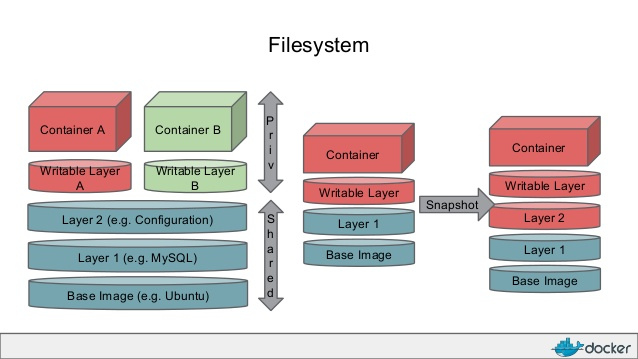

#Docker Hand by Hand

廖子慶  
2016/10/20 <!-- .element: align="right" -->

--

#Who am I?

 <!-- .element: width="15%" style="float:left;margin-left:150pt;" -->

1. 資安愛好者
1. 新技術愛好者
1. blog http://www.duckll.tw
1. slides http://io.duckll.tw
1. seedcard http://seedcard.duckll.tw

---

## 你知道沙箱測試嗎？

--

## 一台會還原的電腦？ <!-- .element: class="fragment" -->
## Virtual Machine<!-- .element: class="fragment" -->
## Virtual Box<!-- .element: class="fragment" -->
## VMware Workstation<!-- .element: class="fragment" -->
## Parallels Desktop<!-- .element: class="fragment" -->

--

## 效能好差 什麼都跑不動 LAG~<!-- .element: class="fragment" -->
## 佔好多容量 放得下3台?<!-- .element: class="fragment" -->
## 又忘了快照 重灌！不停地重灌！ <!-- .element: class="fragment" -->

---

# [Docker](https://www.docker.com/)

--

# 為什麼要用Docker

|                    | Contaioner |    VM    |
|        ---         |    ---     |   ---    |
|   Startup speed    |    sec.    |   min.   |
| Image size(ubuntu) |  &#60;1GB  | &#62;2GB |
|    Performance     | like org.  | emulator |
|   release repo.    |  &#62;10k  | &#60;1k  |

--

# 比較

--

# 應用

1. 快速建置開發環境
1. 模擬多台機器
1. 沙箱測試

---

# 內部架構

---

# Image

1. Read Only
1. Like .ova

--

# Command

|             Command             |            Purpose            |
|               ---               |              ---              |
|             images              |     show all local images     |
|       pull {image}[:tag]        |        donwload image         |
|        rmi {image}[:tag]        |         remove images         |
|   commit {contaioner} {image}   | creat a image (not recommand) |
| save save -o {filename} {image} |    export image as a file     |
|      load &#60; {filename}      |   import image from a file    |

---

# Contaioner

1. Writable
1. Accessable

--

# Command
|                Command                |            Purpose            |
|                  ---                  |              ---              |
|                 ps -a                 |     show all contaioners      |
|    run [options] {image} [command]    |      creat a contaioner       |
|          start {contaioner}           |       start contaioner        |
| exec [options] {contaioner} [command] | execute command to contaioner |
|           kill {contaioner}           |        stop contaioner        |
|            rm {contaioner}            |      remove a contaioner      |

---

# Demo

1. 建立網站
1. 網站防護
1. 消耗資源比較

--

# Adcance

1. https://hub.docker.com/
1. Dockerfile
1. Automatic Build

---

#Q&A

--

# Refrence

https://philipzheng.gitbooks.io/docker_practice/content/introduction

--

#END

