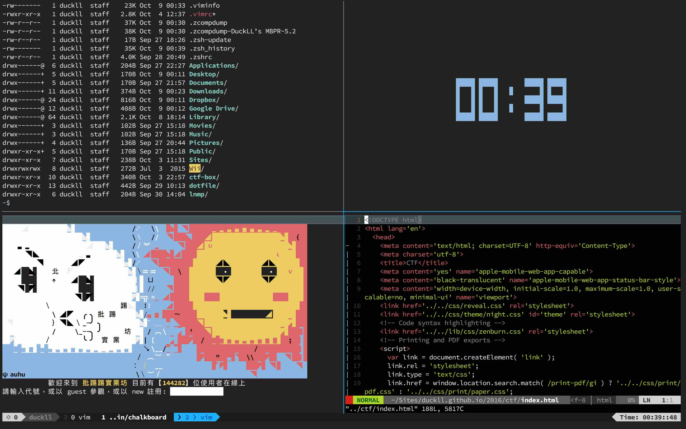

#Linux

廖子慶  
2016/10/04 <!-- .element: align="right" -->

---

#Environment

--

# [Docker](https://www.docker.com/)

--

# Tool

1. http://cmder.net/ (for Windows)
1. https://github.com/powerline/fonts/tree/master/SourceCodePro 

--

# Usage

| Command | Purepose | option |
|   ---   |   ---    |  ---   |
|  pull  | get image from hub |  |
| images | show local images  |  |
|   run   | create a container| i,d,t,name,rm,p,v |
| exec  | connect to a container | i,t |
|  ps   | show containers state  |  a  |
|  rm   |    remove container    |     |
|  rmi  |      remove image      |     |
| kill  |    stop a continer     |     |
| start |    start a continer    |     |

--

#CTF_Box

```dockerfile
FROM phusion/baseimage:latest

ENV TERM screen-256color

CMD ["/sbin/my_init"]

# apt-get
RUN dpkg --add-architecture i386 \
&& apt-get update \
&& apt-get upgrade -y \
&& apt-get install -yq \
bash-completion \
exuberant-ctags \
gdb \
git \
g++-multilib \
libffi-dev \
libssh-dev \
nasm \
nmap \
python-pip \
tmux \
vim \
wget \
&& apt-get clean

#pip
RUN pip install --upgrade pip \
&& pip install \
ipython \
pwntools

#dotfiles
RUN cd ~ \
&& git clone https://github.com/DuckLL/ctf-box.git \
&& cp ~/ctf-box/.tmux.conf ~/.tmux.conf \
&& cp ~/ctf-box/.vimrc ~/.vimrc \
&& mkdir -p ~/.vim/colors/ \
&& cp ~/ctf-box/Tomorrow-Night-Bright.vim ~/.vim/colors/Tomorrow-Night-Bright.vim

#vim plugin
RUN git clone https://github.com/gmarik/Vundle.vim.git ~/.vim/bundle/Vundle.vim \
&& vim +PluginInstall +qall

#gdb
RUN git clone https://github.com/longld/peda.git ~/peda \
&& git clone https://github.com/scwuaptx/Pwngdb.git ~/Pwngdb \
&& cp ~/Pwngdb/.gdbinit ~/


FROM duckll/ctf-box:small

ENV TERM screen-256color

EXPOSE 3002 4000

CMD ["/sbin/my_init"]

# apt-get
RUN apt-add-repository --yes ppa:pwntools/binutils \
&& echo "deb http://ppa.launchpad.net/pwntools/binutils/ubuntu vivid main" > /etc/apt/sources.list.d/pwntools-ubuntu-binutils-xenial.list \
&& apt-get update \
&& apt-get install -yq \
bash-completion \
binutils-*-linux-gnu* \
gdb-multiarch \
libc6-*-cross \
make \
p7zip-full \
qemu \
qemu-user \
qemu-user-static \
sudo \
&& apt-get clean

#qemu
RUN mkdir /etc/qemu-binfmt \
&& ln -s /usr/mipsel-linux-gnu /etc/qemu-binfmt/mipsel \
&& ln -s /usr/arm-linux-gnueabihf /etc/qemu-binfmt/arm

#qira
RUN cd ~ \
&& git clone https://github.com/BinaryAnalysisPlatform/qira.git \
&& cd qira/ \
&& ./install.sh \
&& ./fetchlibs.sh

```

--

# Install

```bash
docker pull duckll/ctf-box:mid
docker run -id --name ctf -p 3002:3002 -p 4000:4000 --privileged --security-opt seccomp:unconfined duckll/ctf-box:mid
```

# Use
```bash
docker start ctf
docker exec -it ctf [script /dev/null -c 'tmux', tmux]
```

---

#Linux

--

#Basic
| Command |     Purpose      |
|   ---   |       ---        |
|   ls    |    list file     |
|   cd    | change directory |
|   cp    |    copy file     |
|   mv    |    move file     |
|   rm    |   remove file    |
|  mkdir  | create directory |

--

#Advance
| Command |     Purpose      |
|   ---   |       ---        |
|  chmod  | change privilege |
|  echo   |      print       |
|   cat   |    print file    |
|  grep   |   search text    |
|  find   |   search file    |
|  kill   |   kill process   |
|  exit   |       exit       |

--

#Shell Operator
| Command | Purpose |
|   ---   |   ---   |
|      ;       |    split two command    |
|      &&      |     if exit(0) than     |
| &#124;&#124; |    if !exit(0) than     |
|      >       | output to file(rewrite) |
|      >>      | output to file(append)  |
|    &#60;     |     input from file     |
|    &#124;    |  pipe:output as input   |

--

#Tips
| Command  |   Purpose    |
|   ---    |     ---      |
| up, down |   history    |
|  ctrl+r  |    search    |
|  ctrl+l  |    clear     |
|  ctrl+u  |    reset     |
|   tab    | autocomplete |

--

#Practice

1. find the passwd
1. create a directory
1. copy it your directory
1. rename it to ppap
1. find "www" in ppap
1. write some strings to ppap
1. print ppap

--

#More

http://linux.vbird.org/

---

#Tmux

```conf
# Use something easier to type as the prefix.
set -g prefix C-u
unbind C-b
bind C-u send-prefix

# reload config without killing server
bind R source-file ~/.tmux.conf \; display-message "Config reloaded..."

# Pane movement
bind h select-pane -L
bind j select-pane -D
bind k select-pane -U
bind l select-pane -R

# mouse in tmux
set -g mouse on
bind -n WheelUpPane if-shell -F -t = "#{mouse_any_flag}" "send-keys -M" "if -Ft= '#{pane_in_mode}' 'send-keys -M' 'select-pane -t=; copy-mode -e; send-keys -M'"
bind -n WheelDownPane select-pane -t= \; send-keys -M

# Support for 256 colors
set -g default-terminal "screen-256color"

# Main Pane
setw -g main-pane-width 120

# Custom status bar
#set-option -g status-utf8 on

# Activity
setw -g monitor-activity on
set -g visual-activity on

# renumber windows sequentially after closing any of them
set -g renumber-windows on

# fixes the delay problem
set -sg escape-time 0


# Use vim keybindings in copy mode
setw -g mode-keys vi

# Setup 'v' to begin selection as in Vim
bind-key -t vi-copy v begin-selection

# split windows like vim
# vim's definition of a horizontal/vertical split is reversed from tmux's
bind - split-window -v
bind \ split-window -h

# new tab
bind C-t new-window

# list sessions
bind L choose-tree

# Bad Wolf
set -g status-fg white
set -g status-bg colour234
set -g window-status-activity-attr bold
set -g pane-border-fg colour245
set -g pane-active-border-fg colour39
set -g message-fg colour16
set -g message-bg colour221
set -g message-attr bold

# Custom status bar
set -g status-left-length 150
set -g status-right-length 150
set -g status-interval 1

# Inconsolata-dz-Powerline Theme:
set -g status-left ''
set -g status-right ""
set -g window-status-format "#[fg=white,bg=colour234] #I #W "
set -g window-status-current-format "#[fg=white,bg=colour34] #I #W " 
```

--

#Basic
|   Command   |   Purepose    |
|     ---     |      ---      |
|   ctrl+u    |    prefix     |
|      c      |    new tab    |
|      n      |   next tab    |
|      \      | split window  |
|      -      | split window  |
|    space    | resize window |

--

#Advance
|   Command   |   Purepose    |
|     ---     |      ---      |
|      !      | panel to tab  |
|      [      |  select mode  |
|      v      |    select     |
|      y      |     copy      |
|      ]      |     paste     |

--

# Practice


--

#More
https://danielmiessler.com/study/tmux

---

#Vim

## 3 Mode

1. normal
1. insert
1. visual 

--

#Control

| Command |  Purepose   |
|   ---   |     ---     |
|  hjkl   |  move ⬅️⬇️⬆️➡️  |
|    w    | move a word |
|    b    | back a word |
| ctrl+f  |  page down  |
| ctrl+b  |  page back  |
|    H    |  page head  |
|    L    |  page end   |
|    :    |  goto line  |
|    /    |    find     |

--

#Control(cont.)
| Command | Purepose |
|   ---   |   ---    |
|    y    |   yank   |
|    x    |   cut    |
|    p    |   past   |
|    d    |  delete  |
|    .    |  again   |
|    u    |   undo   |
| ctrl+r  |   redo   |
|    c    |  change  |

--

#Visual
| Command |   Purepose   |
|   ---   |     ---      |
|    v    |    select    |
|    V    | select line  |
| ctrl+v  | select block |

--

#Insert
| Command |   Purepose   |
|   ---   |     ---      |
|    i    | insert here  |
|    I    | insert head  |
|    A    |  inser end   |
|    R    | replace here |
| ctrl+c  |     exit     |

--

#Close
| Command |   Purepose    |
|   ---   |      ---      |
|   :wq   | save and quit |
|   :q!   |  quit force   |
| :w file | save to file  |

--

##My vim config

```vim
" Install vim-plug
set nocompatible
call plug#begin()

" UI
Plug 'vim-airline/vim-airline'
let g:airline_powerline_fonts = 1
Plug 'tomasr/molokai'
let g:molokai_original = 1
let g:rehash256 = 1

" Feature
Plug 'majutsushi/tagbar'
let g:tagbar_show_linenumbers = 1

" Autocomplete
Plug 'MarcWeber/vim-addon-mw-utils'
Plug 'tomtom/tlib_vim'
Plug 'garbas/vim-snipmate'
Plug 'honza/vim-snippets'
Plug 'Shougo/deoplete.nvim'
let g:deoplete#enable_at_startup = 1
Plug  'scrooloose/syntastic'
set statusline+=%#warningmsg#
set statusline+=%{SyntasticStatuslineFlag()}
set statusline+=%*
let g:syntastic_always_populate_loc_list = 1
let g:syntastic_auto_loc_list = 1
let g:syntastic_check_on_open = 1
let g:syntastic_check_on_wq = 0

" Hotkey
Plug 'vim-scripts/auto-pairs'
Plug 'scrooloose/nerdcommenter'
Plug 'michaeljsmith/vim-indent-object'
Plug 'ervandew/supertab'
let SuperTabMappingForward="<S-Tab>"
Plug 'easymotion/vim-easymotion'
let g:EasyMotion_smartcase = 1

" Python
Plug 'hdima/python-syntax',{'for': ['python']}
let python_highlight_all = 1
Plug 'zchee/deoplete-jedi',{'for': ['python']}

call plug#end()

filetype plugin indent on

" Hotkey
map  n       <Plug>(easymotion-next)
map  N       <Plug>(easymotion-prev)
nmap ;       :
vmap ;       :
map  /       <Plug>(easymotion-sn)
omap /       <Plug>(easymotion-tn)
nmap \       zR
nmap <C-a>   ggVG
nmap <C-k>   H<Plug>(easymotion-w)
nmap <C-l>   :nohl<CR>
nmap <C-t>   :TagbarToggle<CR><C-w>l
nmap <C-y>   :set paste!<CR>
nmap <C-5>   :set fileencoding=big5<CR>
nmap <C-8>   :set fileencoding=utf8<CR>
nmap <Enter> za
vmap <Enter> <Plug>(EasyAlign)
nmap <Tab>   gt
nmap <S-Tab> gT

" Evil shift!
cab Q   q
cab Qa  qa
cab W   w
cab X   x
cab WQ  wq
cab Wq  wq
cab wQ  wq
cab Set set

" Setting
let mapleader=" "                      " leader key
syntax on                              " Color syntax
color molokai                          " Theme
set backspace=start,eol,indent         " Backspcae
set clipboard=unnamed                  " Clipboard
set cursorline                         " height corrent line
set encoding=utf-8                     " Necessary to show Unicode glyphs
set fileencodings=utf8,big5,gbk,latin1 " set fileopentype
set hls                                " search heightlight
set ignorecase                         " ignore case in search
set incsearch                          " search back
set laststatus=2                       " Always show the statusline
set mouse=a                            " Use mouse
set number                             " Line number
set ruler                              " show line info
set scrolloff=5                        " scroll while close under
set showcmd                            " show command
set smartindent                        " Autoindent
set t_Co=256                           " Explicitly tell Vim that the terminal supports 256 colors
set timeoutlen=300                     " escape delay
set wildmenu                           " Autocomplete menu

" Tab
set expandtab
set shiftwidth=4
set softtabstop=4
set tabstop=4

" Folding
set foldenable
set foldmethod=indent
set foldcolumn=1
set foldlevel=4

" Filetype Related
autocmd FileType python setlocal et sta  sw=4 sts=4 cc=80 completeopt-=preview
autocmd FileType html   setlocal et sw=2 sts=2
autocmd FileType ruby   setlocal et sw=2 sts=2

" Run File
autocmd filetype ruby       nnoremap <C-c> :w <bar> exec '!ruby '.shellescape('%') <CR>
autocmd filetype javascript nnoremap <C-c> :w <bar> exec '!node '.shellescape('%') <CR>
autocmd filetype shell      nnoremap <C-c> :w <bar> exec '!bash '.shellescape('%') <CR>
autocmd filetype php        nnoremap <C-c> :w <bar> exec '!php -f '.shellescape('%')<CR>
autocmd filetype python     nnoremap <C-c> :w <bar> exec 'term python '.shellescape('%')<CR>
autocmd filetype c          nnoremap <C-c> :w <bar> exec '!gcc -o %:r '.shellescape('%').' -O3 && ./%:r'<CR>
autocmd filetype cpp        nnoremap <C-c> :w <bar> exec '!g++ -o %:r '.shellescape('%').' -std=c++11 -O3 && ./%:r'<CR>
```

--

|  Command   |   Purepose   |
|    ---     |     ---      |
|   ctrl+a   |  select all  |
|    vii     | select scope |
| <Space>cc  |   comment    |
| <Space>,cu |  uncomment   |

--

#Practice

http://vim-adventures.com/

Write a gcd() c program

--

#More

[跟著龍哥學vim](http://kaochenlong.com/category/vim/)

---

#Q&A

--

#END

