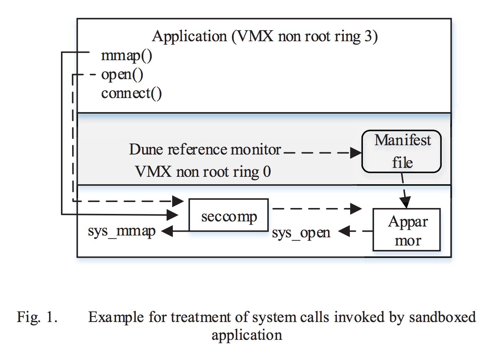
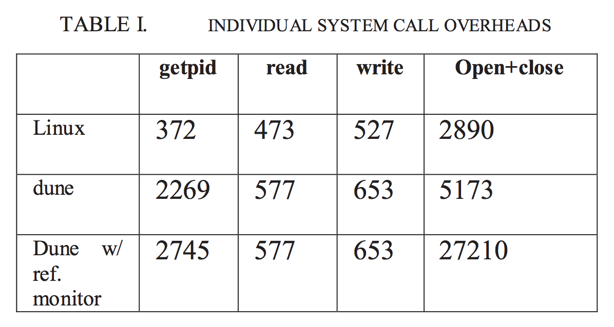
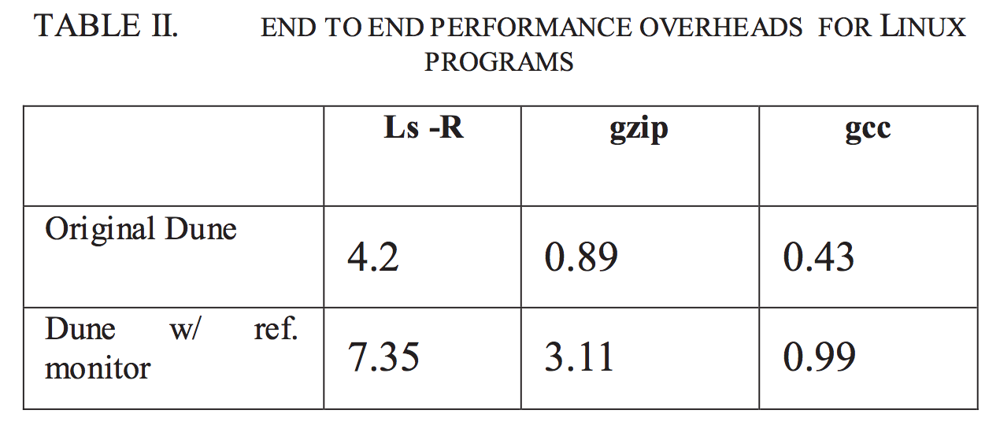

## Design and Implementation of Sandbox Technique for Isolated Applications

廖子慶  
2016/12/28 <!-- .element: align="right" -->

--

# Outline

1. Introduction
1. Background and Preliminares
1. System Overview
1. System Design and Details
1. Evaluation
1. Conclusion

---

# Introduction

--

## Why sandbox

* unknow vulnerability
* unrestricted access
* system call
* network
* file system

--

## Exist solution

* VM
* VM alike
* system level filter

---

# Background and Preliminares

--

## Intel Virtualization extensions

improve performance

* VMX root
* VMX non

--

## VM alike isolation

OS level virtualization

* Solaris zones
* dune
* Graphene

--

## Sandboxing

restrict process access to kernel and system data

* firejail
* seccomp
* Apparmor

--

## dune

* VTx
* EPT
* VMM

--

## Seccomp filters

* syscall table
* whitelist
* blacklist

--

## Apparmor

default in Ubuntu

* Mandatory Access Control
* define and enforce policies

--

## Manifest files

facilitate the execution environment by getting configurations

---

# System Overview

* dune
* seccomp
* Manifest file
* Apparmor

--

---

# System Design and Details

1. Non-modification
1. Non-tampered
1. Complete mediation

--

## Integration with dune

* dune_init
* dune_enter
* load ld-linux.so
* implemented ELF loader
* map ld-linux in dune mode
* load binary

--

## Security enforcement

* system call -> seccompt
* memory related call -> EPT(Extention Page Tables)
* other papaer tool -> Manifset file
* network and file system -> Apparmor

---

# Evaluation

--

--

---

# Conclusion

* system call performance overheads
* end to end performance overheads
* acceptable range for achieved security

---

#Q & A

--

#END

