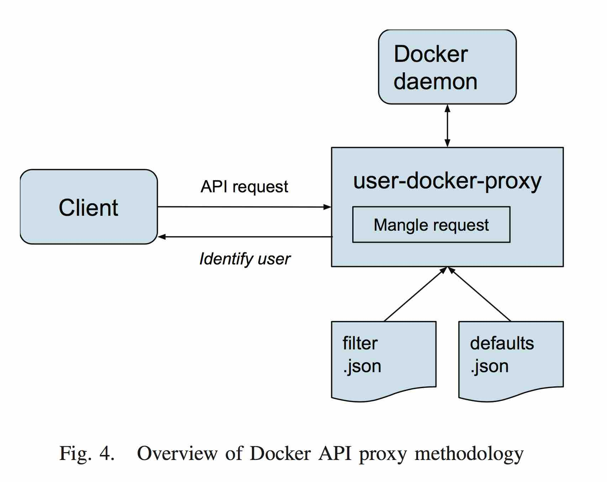

## Securing User Deined Container for Scientific Computing

Author: Dieter Sibold, Kristof Teichel  
Source: High Performance Computing & Simulation (HPCS), 2016 International Conference on <!-- .element: align="left" -->

Zih-Cing Liao (DuckLL)  
2016/10/05 <!-- .element: align="right" -->

--

# Outline

1. Introduction
1. Docker in HPC
1. Expoiting Docker
1. Strategies for Security
1. Implementation
1. Summary

---

# Introduction

1. HPC
1. Docker
1. Security

--

# HPC

High Performance Computing  
for Scientific Computing

--

# Docker

1. Fundamental incompatibilitis
1. Software optimised for architecture
1. Little overhead

--

# Security

1. Docker run as root
1. Easy to expoit

---

# Docker in HPC

1. Enable parallel program
1. Native preformance
1. UberCloud

--


---

# Expoiting Docker

1. Privilege escalation
1. Denial of service
1. Container ownership
1. Software vunlnerabilities

--

# Privilege escalation

1. Volumes allow mirrored
1. UID of 0

```shell
user@host:~$ docker run -v /etc/shadow busybox cat /tmp/shadow
```

```shell
user@host:~$ docker run -v $PWD:/tmp/host debian /bin/sh -c \
'cp /bin/sh /tmp/host/sh && chmod a+s /tmp/host/sh'
user@host:~$ ./sh
# whoami
root
```

--

# Denial of service

1. Fork bomb
1. Nested directories
1. Resource limits by the kernel
1. Default 1048576 processes

--

# Container ownership

1. Docker daemon
1. All the same

--

# Software vunlnerabilities

1. No system initialisation
1. PID 1
1. Images not update

---

# Strategies for Security

1. User namespace support
1. Aware of user define value
1. Unix user friendly (not admin)
1. Privileged mode access host avoid
1. Drop kernel module load
1. Protect port less than 1024

---

# Implementation

1. API
1. Define and enforce default option
1. Filter unsafe feature
1. Ovserve container ownership for multiple user

--



--

```log
http: processing request POST
/v1.20/containers/2c17... for user 1000
debug: container owner matched 1000
debug: start is allowed
http: processing request GET /v1.20/containers/json
for user 1000
debug: json is allowed
http: processing request GET /v1.20/containers/json
for user 2000
debug: json is allowed
block: strip container 2c17...
```

```json
{
    "User": "",
    "Cmd": [
        "cat",
        "\/etc\/shadow"
    ],
    "Image": "debian",
    "Labels": {
    },
    "HostConfig": {
    "Binds": [
        "\/etc:\/etc"
    ],
    "Privileged": true,
    }
}
```

```shell
user@host: ̃$ docker run -v /etc/shadow:/tmp/shadow
busybox cat /tmp/shadow
cat: can’t open ’/tmp/shadow’: Permission denied
```

--

# Done

1. HTTP POST
1. JSON config
1. User Information
1. UID check
1. Volume permission
1. Maintain easy

---

# Summary

1. Securing user define container using API proxy
1. HPC using Docker
1. Easily extened to other container runtime tools

---

#Q&A

--

#END

