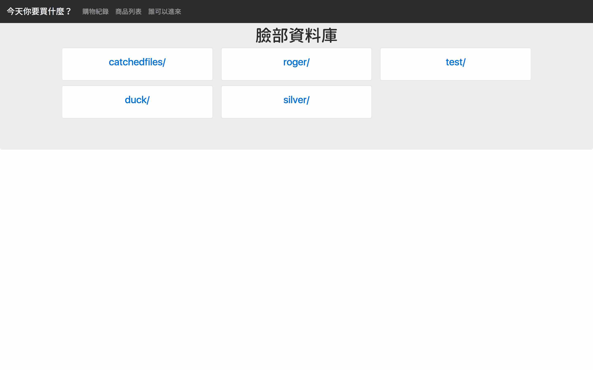

# 今天你要買什麼？

Team3: 胡裕人 廖子慶 陳柏穎  
2017/5/26 <!-- .element: align="right" -->

--

# 情境

歡迎進入智慧賣場  
門口的裝置辨識臉孔後  
請您前往休息區  
手機 APP 會跳出購物小幫手  
運用語音對談或是文字輸入來選取商品  
賣場人員在收到購物清單後會幫您拿取商品  
喝完飲料 您的商品也送來了

<audio controls>
<source src="http://tts.itri.org.tw/TTSservice/download/itri/149579571413161.wav" type="audio/wav">
</audio>

---

# AWS API

1. EC2
1. Elastic Beanstalk
1. DynamoDB
1. Mobile Hub
1. Lambda
1. SNS
1. API Gateway
1. Lex
1. Rekognition

--

# 系統架構圖

 <!-- .element: width="70%" -->

---

## 掃描人臉

--

## 聊天機器人

---

# DEMO

[web](http://silver-web.gmmyzgucb7.us-east-1.elasticbeanstalk.com/)
[iot](http://172.20.54.238:8081/)

--

--

--

--

--

--

 <!-- .element: width="40%" -->

--

 <!-- .element: width="40%" -->

---

#Q & A

--

#END
