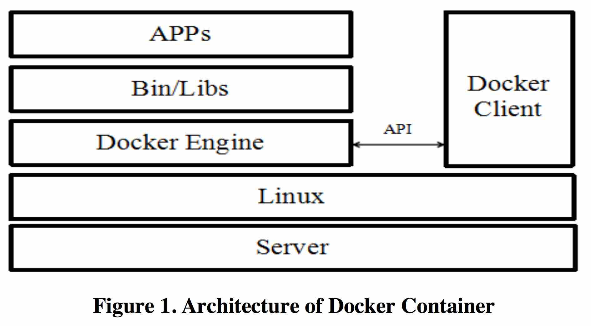
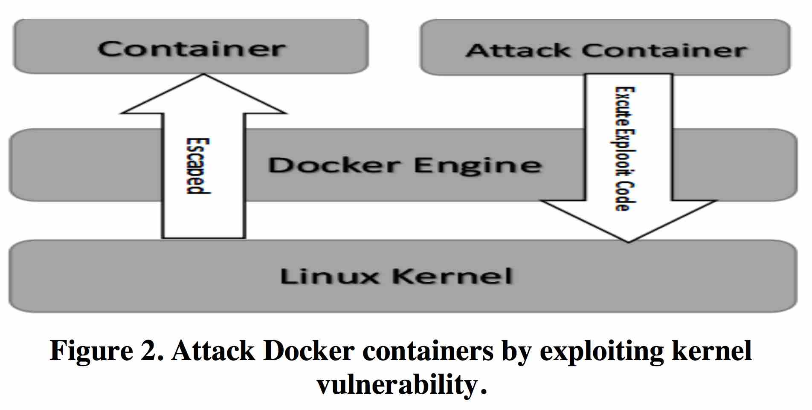

## A Defense Method against Docker Escape Attack

Author(s): Zhiqiang Jian, Long Chen  
Source: Proceedings of the 2017 International Conference on Cryptography, Security and Privacy <!-- .element: align="left" -->

Zih-Cing Liao(DuckLL)  
2017/5/31 <!-- .element: align="right" -->

--

# Outline

1. Introduction
1. Background
1. Docker Security
1. Docker Escape Technology
1. A Defense Method Based on Namespaces Status Inspection
1. Conclusion

---

## Introduction

- Container-base cloud platform
- System virtualization
- Complete filesystem
  - code
  - runtime
  - system tools
  - system libraries
- Share resource
  - CPU
  - memory
  - disk
  - network

--



---

# Background

--

## Docker

- Linux namespace
- Cgroup
- SELinux

--

## Attack target

- continers
- host system
- collocated container
- code repositories
- images repositories
- management network

--

## CVE

- path tracersal(CVE-2014-6407, CVE-2014-9356, and CVE-2014-9358)
- chroot escapes(CVE- 2014-9357, CVE-2015-3627)
- access to special file system on the host(CVE-2015-3630)

--

## Weak point

- /proc
- /sys
- /proc/kallsyms

---

# Docker Security

--

## Linux Namespaces

A namespace wraps a global system resource in an abstraction

- UTS
- IPC(inter-process)
- PID(process id)
- Network
- Mount
- User

--

## Copy-on-Write

- reduce the consumption
- ensure data isolation

--

## Capability

- privileged processes(bypass all kernel permission checks)
- unprivileged processes

--

## Cgroup

Control group

is a Linux kernel feature that limits, accounts for, and isolates the resource usage (CPU, memory, disk I/O, network, etc.) of a collection of processes

--

## Seccomp

syscall filter

docker default filter

- bpf
- mount
- keyctl
- ptrace

--

## Image Security

- Docker Hub
- The Update Framework
- Docker Content Trust
- TLS
- PKI

---

# Docker Escape Technology

--



--

# Switch Namespaces

--

```c
struct task_struct{
    ...
    pid_t pid;
    struct task_struct __rcu *real_parent; struct fs_struct *fs;
    /* namespaces */
    struct nsproxy *nsproxy;
    ...
}
```

nsproxy contains namespace information

--

When a syscall, the user stack space will be switched to the kernel stack space
Kernel symbols of get current reset lower 13bits(8K) of the ESP

| stack               |
| ------------------- |
| Current task struct |
| ...                 |
| Kernel symbols      |
| ...                 |
| ↕8k                 |
| ESP                 |

--

## Exploit

1. get into kernel
1. collect the kernel symbols
1. loop back to the parent of process
1. mount the initialization fs to container fs
1. convert the container namespace to the host

```c
struct task_struct *task= get_current();
while(task -> pid != 1){
    task = task->real_parent;
}
init_nsproxy = task->nsproxy;
init_fs = task->fs;
struct task_struct *tsk= get_current();
daemonize_fs_struct();
switch_task_namespaces(tsk, init_proxy);
commit_creds(prepare_kernel_cred(0));
execv("/bin/sh", NULL);
```

--

## Modifying Shared Memory

The "vDSO"(virtual dynamic shared object) is a small shared libarary that the kernel automatically maps into the address space of all user-space applications.

--

## Exploit

1. vulnerability can modify vDSO address
1. write shellcode address to vDSO
1. hook gettime()
1. shellcode check root privileged
   1. root -> launch a shell to get root
   1. else -> call gettime as normally

---

## A Defense Method Based on Namespaces Status Inspection

--

## Definitions

- Pid: the process ID.
- Nsid: the relative namespaces tag of the process.
- Pname: name of the process.
- Process: a struct of processes in the container including the members of pid,nsid,Pname.
- Container: a struct including the members Container_Process, Container_Init_Process which is process and initialization process of the container.

```c
struct Process{
    int Pid;
    int Nsid;
    string Pname;
}
struct Container{
    struct Process Container_Init_Process;
    struct Process Container_Process;
}
```

--

## Inspection

- Shell Script
- pstree tool
- enumerate processes in containers

--

## Get Metadata

```shell
sudo docker ps
pstree -Aup
ls -l /proc/pid/ns
```

--

## Status Inspection

Once it detects an anomaly process

- kill the process
- tack the malicious user by finding the process's UID

--

# Experimentation

| Vulnerability | Description                                            | Result |
| ------------- | ------------------------------------------------------ | ------ |
| CVE-2014-0038 | The recvmsg system-call has a heap overflow            | ✓      |
| CVE-2016-5195 | Conditional competition causes arbitrary address write | ✓      |

---

# Conclusion

- Kernel-shard architecture model
- Kernel vunlnerability 0day
- Monitor process during runtime
- Ensure security and reliable operation of the continer

---

#Q & A

--

#END

Thank you for listening!
