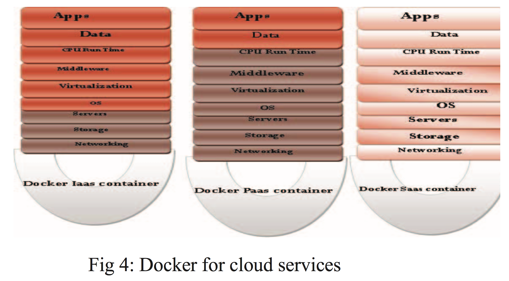

## Docker Container Security via Heuristics-Based Multilateral Security- Conceptual and Pragmatic Study

Author(s):A R Manu, Jitendra Kumar Patel, Shakil Akhtar, V K Agrawal, K N Bala Subramanya Murthy
Source: Circuit, Power and Computing Technologies (ICCPCT), 2016 International Conference on <!-- .element: align="left" -->

Zih-Cing Liao  
2017/4/19 <!-- .element: align="right" -->

--

# Outline

1. Introduction
1. Multilateral Security
1. Heuristic Approach Achieving Multilateral collaboration
1. Linux Container
1. Docker Security Analysis
1. OSI/TCP/IP Stack Model
1. Anticipated Pragmatic
1. Results

---

# Introduction

- Hybrid community computing model
- Multilateral Security
- Security in cloud computing
  - not a priority
  - no time to market
  - no return on investment
- Docker container stack architecture

--


---

## Multilateral Security

```
Multilateral Security means taking into consideration the security requirements of all parties involved.
It also means considering all involved parties as potential attackers.
```

---

- vendor
- customer

---

1. In view of disagreements
1. In respect of benefit
1. Supporting autonomy

--

### US Dept.of Defense(DOO)

- Bell-La-pa-dula model
- Biba Model
- Chinese wall
- Prevent-detect-recover
- Cual control
- Functional separation
- Mandatory and Discretionary access control

--

## Multilateral co-ordination mechanism


---

## Heuristic Approach Achieving

### Ants groceris foraging and shell.

routing algorithms

- speed
- security
- energy efficiency

---

# Linux Container

- LXC
- Kernel-Control-Groups(c-groups)
- Kernel Name spaces
- Docker
- Rkt

--

## LxC architecture


--

# Docker

1. User layered file system
1. copy-on-write system
1. Portable
1. self-sufficient

--

## Docker as a service



--

## Docker vs. VM


--

## Docker security analysis

1. supervision
1. monitoring
1. configuration
1. governance
1. regulating

--

## Docker security Architecture


--

## c-Advisor Internals


--

## Docker security network


--

## Docker with Kubernetic

 <!-- .element: width="70%" -->
 <!-- .element: width="70%" -->

---

## OSI/TCP/IP Stack Model

1. docker run with root privileges
1. using UNIX socket
1. hardware signing
1. use templates

--

## TCP IP Stack model


--

## Hybird Cloud prototype


--

## security requirments

1. need not trust each other
1. voting
1. rating
1. vulnerability exploiting the business and loss incurred
1. analyzes the complexity
1. fuzziness
1. paradox of security requirments

--

## attain the balanced security

1. PAXOS

```
Paxos is a family of protocols for solving consensus in a network of unreliable processors.
Consensus is the process of agreeing on one result among a group of participants.
This problem becomes difficult when the participants or their communication medium may experience failures
```

1. [Raft algorithm](https://raft.github.io/)

```
Raft is a consensus algorithm that is designed to be easy to understand. It's equivalent to Paxos in fault-tolerance and performance.
```

--

## Automated support

1. continuously
1. mutualyy monitor
1. provisioning
1. cataloging
1. brokering
1. orchestrating

--

### ISO stack model

| id  | layer        | description                                                                           |
| --- | ------------ | ------------------------------------------------------------------------------------- |
| 7   | application  | harmonization of collaborating actions, file and job shift, e- mail                   |
| 6   | presentation | Character sets, data structures                                                       |
| 5   | session      | Synchronization spot, roll-back, coupon power of discours                             |
| 4   | transport    | continuous sequence control, uninterrupted error control, hysterically stream control |
| 3   | network      | steering, usage sub-networks, progression control, flow control                       |
| 2   | data link    | framework, fault power and revitalization, series manage, flow direct                 |
| 1   | physical     | shift of physical information                                                         |

--


--

1. analyze patten
1. upper layer and lower layer analysis
1. implemented at user level

--

## Context level diagram


---

# Anticipated Pragmatic

1. superior sofware engineering principles
1. UML to bridge the business
1. IBM rational rose
1. CloudSim
1. OpenNebula toolkit
1. OpenStack

--

## done

1. configuration of imformation
1. resource using cold start/termination
1. continuous monitoring
1. diagnostics
1. reconfiguration

--

## Services security

```python
[' at peer-to-peer level',
 ' end-to-end security rule',
 ' front end to the process and device security',
 ' node point access security',
 ' link level security',
 ' hardware level security',
 ' host level security',
 ' data center level security',
 ' process level layered security',
 ' platform level security',
 ' infrastructure level security',
 ' application level security',
 ' hardware computing inbuilt chip level security',
 ' processor level security',
 ' communication level security',
 ' access point level security',
 ' virtual-ware level security',
 ' firmware level security',
 ' security maintenance of state and overall intelligence at edges',
 ' speed and simplified security protocol',
 ' connection level security',
 ' configuration',
 ' management',
 ' monitoring',
 ' high fidelity secured firewalls',
 ' NAT',
 ' secured wired',
 ' and content caches security']
```

--

## Security protocol stack

1. virtual level security
1. hardware networking level security
1. software level
1. chipset level
1. virtual ware level security

--

## Medium level security

```python
[' network tunnel level security',
 ' communication channel level security',
 ' data security',
 ' error control',
 ' segmentation flow control',
 ' monitoring traffic level security',
 ' congestion control',
 ' application addressing port-level security',
 ' transmission',
 'connection oriented security communication mobile devices level security.']
```

--

## Bit level and byte level security

```python
['link control',
 ' data control',
 ' IP address control',
 ' traffic control',
 ' access control',
 ' Physical infrastructure control',
 ' maintenance monitoring control',
 ' data order control',
 ' error control',
 ' fault control',
 ' defect control',
 ' hardware error control',
 ' replication control',
 ' virus control.']
```

--

## Error detction measures

1. machine level data storage control
1. processing control
1. computing level control

--

## Multiple stream of data security

1. multiplexed
1. multi-homing data control
1. multi-IP address communication control
1. multiple-physical interface control

--

## Presetation and session level security

```python
['libraries',
 ' compiling',
 ' interpreter cached level security',
 ' virtual memory level security',
 ' API level security',
 ' bandwidth level security',
 ' resource system level security',
 ' user level security',
 ' support and maintenance level security',
 ' session level security',
 ' analysis of session time on/at analysis using port numbering',
 ' lightweight thick',
 ' thin client level security at access points.']
```

--

## Other

```python
['Micro-controller firmware network adapter',
 ' link issues',
 ' driver software',
 ' OS level security',
 ' non-programming analysis',
 'digital electronics level security',
 'circuit level security should be implemented.']
```

---

# Results

### Tools

1. TOMOYO
1. AppArmor
1. SeLinux
1. GRSEC

--

## Co-operation and collaboration

## 2p + 0.5e = 4x

- p=productivity
- e=effort
- x=seurity

---

#Q & A

--

#END

Thank you for listening!
