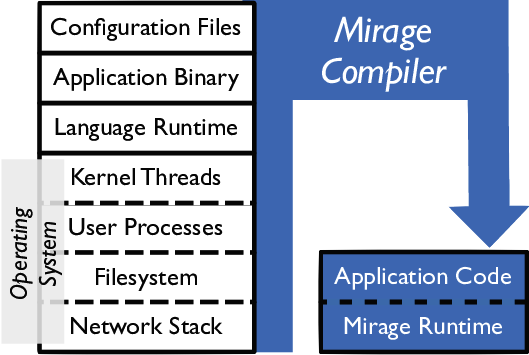

## Enterprise IoT Security and Scalability: How Unikernels can Improve the Status Quo

Author(s):Bob Duncan, Andreas Happe, Alfred Bratterud  
Source:2016 IEEE/ACM 9th International Conference on Utility and Cloud Computing <!-- .element: align="left" -->

Zih-Cing Liao  
2017/3/14 <!-- .element: align="right" -->

--

# Outline

1. Introduction
1. Deploy of IoT
1. Iot Security & Privacy Challenges
1. The Unikernel Angle
1. Challenges, Problems, Limitations
1. Conclusions

---

# Introduction

- Iot data collction would double every 18 months
- 20 billion to 35 billion connect devices in 2020
- Use cloud -> outside the typical firewall
- Fog computing
- Resource-constrained -> can't use traditional security tools(like AV)

---

# Deploy of IoT

- QoS in Iot -> ability to prioritise data streams from different devices
- No agreed standards currently -> difficult indded security promblems.
- Local device need special care to prevent crash
- compact and reduce data on-site
- Server use NoSQL
- Medical and power grid need verifiable computing
- Smart Hourse -> Industry 4.0
- EU’s General Data Protection Act (GDPA) -> protect personal data breaches
- Need ways of updating the millions of deployed devices

---

## Iot Security &

## Privacy Challenges

--

#### Duncan and Whittington 10 Key Security Issues

| Number | Key Security Challenges                   |
| ------ | ----------------------------------------- |
| 1      | The definition of security goals          |
| 2      | Compliance with standards                 |
| 3      | Audit issues                              |
| 4      | Management approach                       |
| 5      | Technical complexity of cloud             |
| 6      | Lack of responsibility and accountability |
| 7      | Measurement and monitoring                |
| 8      | Management attitude to security           |
| 9      | Security culture in the company           |
| 10     | The threat environment                    |

--

## Iot = Web + Mobile

--

### OWASP Top Ten Iot Vulnerabilities 2014

| 2014 Code | Threat                                    |
| --------- | ----------------------------------------- |
| I1        | Insecure Web Interface                    |
| I2        | Insufficient Authentication/Authorization |
| I3        | Insecure Network Services                 |
| I4        | Lack of Transport Encryption              |
| I5        | Privacy Concerns                          |
| I6        | Insecure Cloud Interface                  |
| I7        | Insecure Mobile Interface                 |
| I8        | Insufficient Security Configure-ability   |
| I9        | Insecure Software/Firmware                |
| I10       | Poor Physical Security                    |

---

## The Unikernel Angle

Unikernels are specialised, single address space machine images constructed by using library operating systems <!-- .element: align="left" -->

--

# Client

- Unified interface to diverse hardware
- Parallel-alized development
- Same environment
- IncludeOS
- Atomic update  
  (ChromeOS switch boot partitions to update and backup)

--

# Virtualisation

- Higher capacity
- Sustainability

--

# Server

- Non-mutable state
- Event-based
- Dynamic scale-out
- Local pre-process(using NAS)

---

### Challenges, Problems, Limitations

1. Unikernels are Only a Part of the Solution
1. Production-Level Debugging
1. Impact upon Software Development
1. Virtualisation in the Embedded Space

--

## Unikernels are Only

## a Part of the Solution

Infrastructure for handling

1. roll-out
1. monitoring
1. logging.

has yet to be written.

--

## Production-Level Debugging

- Unikernels lack debugging facilities(no shell)
- Securely connecting the debugging tools to the running unikernel

--

### Impact upon Software Development

- Signle execution thread or process
- Prevents adoption of existing software packages
- Initially limiting resilience resaech to server-side unikernels

--

## Virtualisation in the Embedded Space

- Different architectures, hardware
- No enough resource virtualisation
- KVM/ARM paravirtualization for unlikely
- MIPS also support virtualization

---

# Conclusions

- Iot security or disaster
- No security no privacy
- Experienced and talented developer resources are scarce at hand
- Virtualisation -> reuse existing knowledge and tool
- Cloud unikernels -> Restful
- Homomorphic encryption, verifiable computing

---

#Q & A

--

#END

Thank you for listening!
