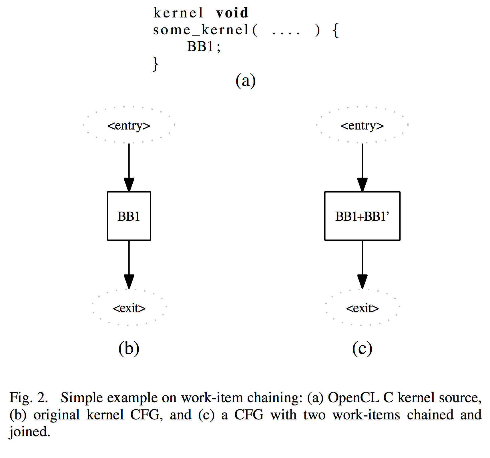
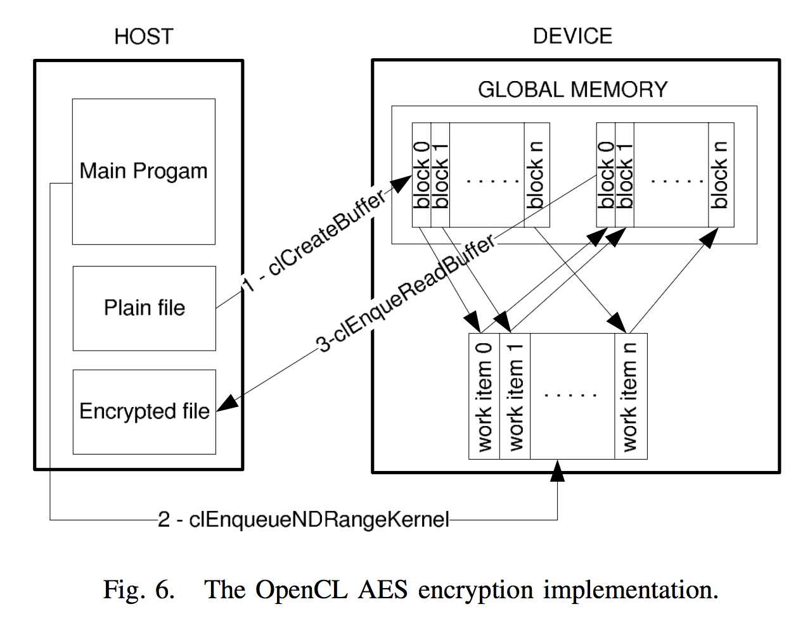

## OpenCL-based Design Methodology for Application-Specific Processors

Author(s): Pekka O. Jääskeläinen∗, Carlos S. de La Lama†, Pablo Huerta† and Jarmo H. Takala∗ <!-- .element: align="left" -->

Source: Embedded Computer Systems (SAMOS), 2010 International Conference on <!-- .element: align="left" -->

Presented by: 廖子慶  
2017/1/3 <!-- .element: align="right" -->

--

# Outline

1. Introduction
1. Related Work
1. Open Computing Language
1. Transport Triggered Architectures
1. Compiling OpenCL For Application-Specific Processors
1. Experiments
1. Conclusion and Future Work

---

# Introduction

1. More processor core > High clock frequencies
1. Custom Hardware operations
1. Application-specific processor hardware accelerator
1. ILP available in the compiled OpenCL kernels

---

# Related Work

1. MCUDA: considerd only at the task level
1. FCUDA: less off-core synchronization
1. MrBayes algorithm: map relatively simple kernel to a pipelined harware design

---

## Open Computing Language

1. Host, Device
1. GPGPU
1. CUDA like
1. work-groups, work-items

--

## Feature

1. Implicit independence
1. Support for multiple disjoint address spcaes
1. No dynamic memory allocation
1. Recusion not supported

---

## Transport Triggered Architectures

1. Remineds VLIW architectures
1. TTA-based Codesign Environment(TCE)
1. LLVM compiler infrastructure
1. Complete design flow
1. Statically scheduled architecture

--

---

## Compiling OpenCL For Application-Specific Processors

--

## Standalone Execution of OpenCL Applications

1. usually unrealistic
1. global, constant memory -> local memory
1. local, private memories -> general-pupose register
1. exploit the instruction scheduling freedom of TTA as much as possible

--

## Chaining Work-Items

1. execute instruction
1. free datapath resources

--

 <!-- .element: width="70%" -->

--

--

 <!-- .element: width="60%" -->

--

## Work-item Chaining Algorithm

1. find the barriers
1. prior flattening
1. maximum number of replications
1. easy to debug
1. improves latter algorithm

--

--

## Efficient Instruction Scheduling of Work-Items

1. customized register allocator
1. base on Linear Scan Register Allocator
1. not even close to optimal
1. more spill code than necessary
1. alias analysis

--

## Custom Operation Support

1. macros
1. inline assembly

--

---

# Experiments

--

## AES 128-bit

1. Gladman's implementation
1. reducing memory read and write

--

 <!-- .element: width="80%" -->

--

--

## AESTTA

1. Custom Operations
1. FPGA
1. MUL_GAL
1. SUBSHIFT

--

---

## Conclusion and Future Work

1. OpenCL extension -> ASP
1. Experiment -> Speedup
1. Exploit task level parallelism in multicore ASP

---

#END
