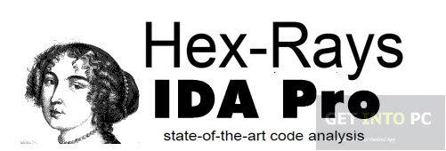
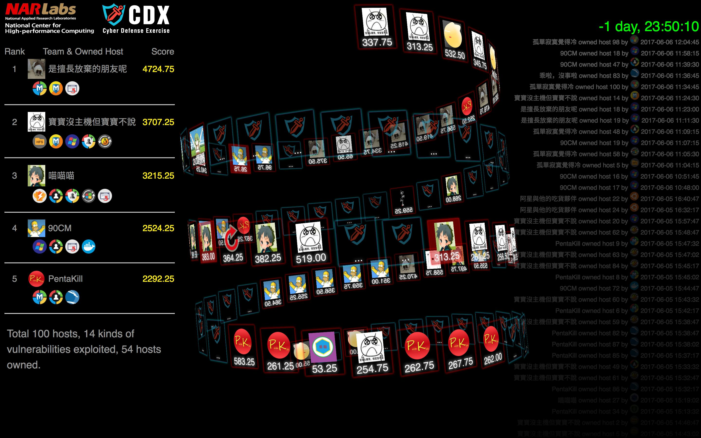
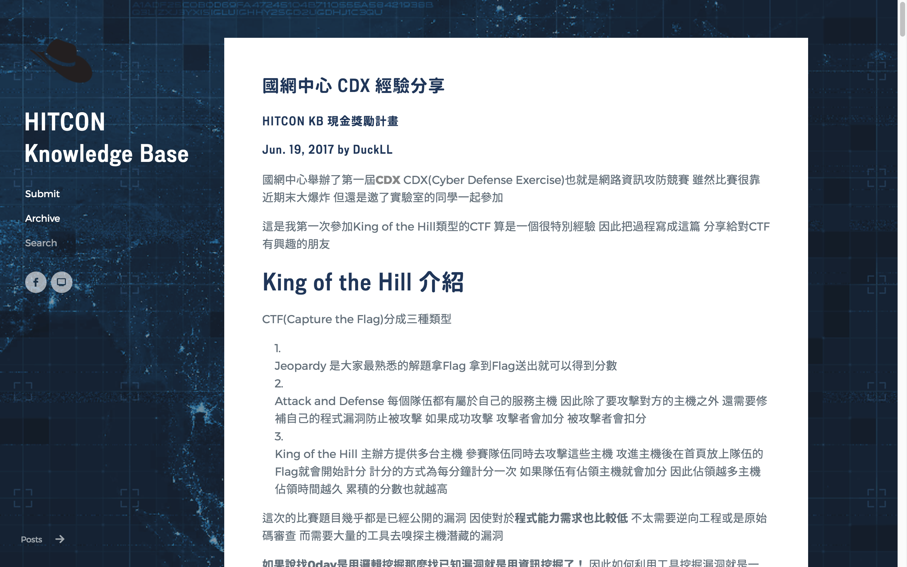
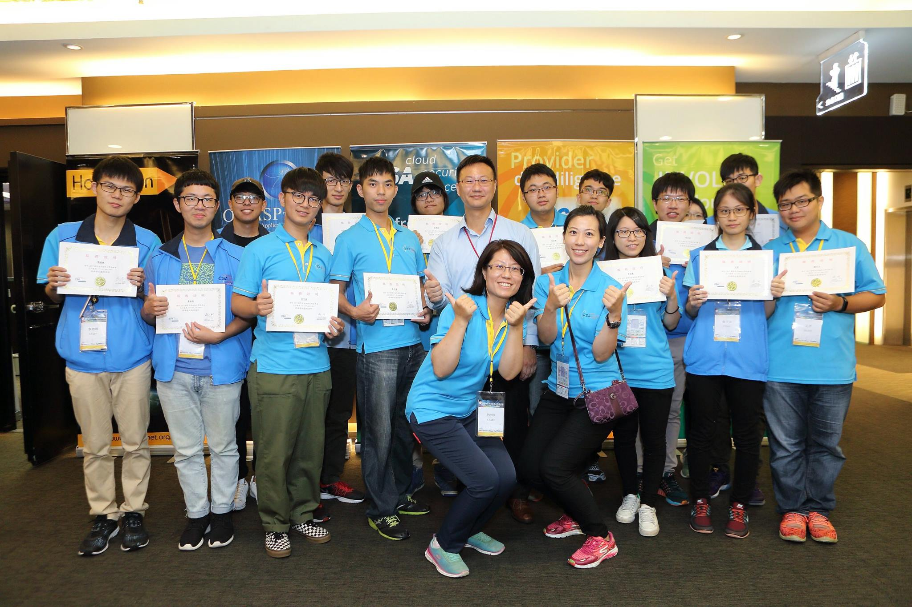

## 從 Pwn 到 All 資安技能成長分享

台灣好厲駭期末展示會 <!-- .element: align="left" -->

學生：廖子慶  
指導老師：鄭欣明教授  
2017/8/24 <!-- .element: align="right" -->

---

# 15 分鐘！

1. 技術不夠
1. 心路歷程

--

# 活動

--

## Windows 鑑識&惡意分析

--

在命案現場 先拿出 IDA 就輸了

--

## Windows 好像很有趣！

1. CFF Explorer
1. procexp
1. Procmon

--

## 國網中心 CDX

--

## HITCON KB

--

## 台灣資安高峰會

---

# 未來目標

1. Windows Reverse
1. CVE(Bug Bounty)
1. Docker QoS
1. CEH
1. TDOHconf Talk(新 Wifi 釣魚 Captive Portal Phishing)
1. HITCON Talk

---

# 總結

--

# 以前我只打 Pwn

--

# 現在我打 All

--

# 感謝這個計畫

1. 資安技能 <!-- .element: class="fragment" -->
1. 擴展人脈 <!-- .element: class="fragment" -->

---

# END

Thank you for listening
