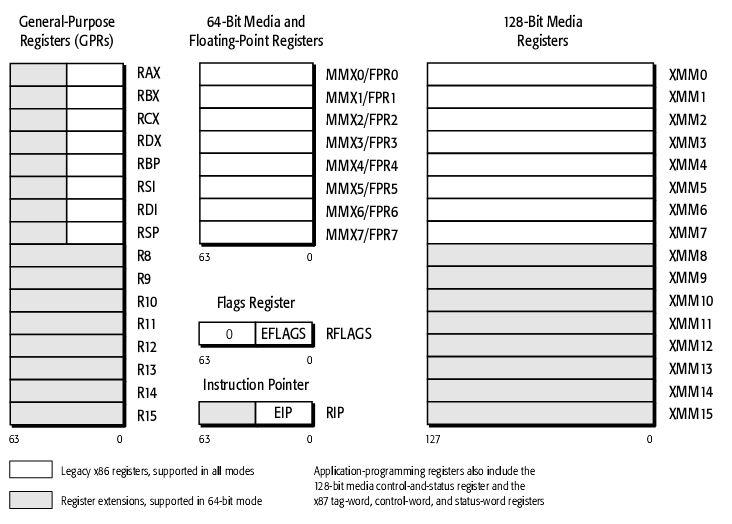
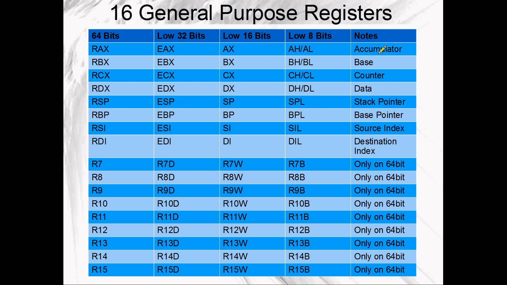

# ASM in Linux

廖子慶  
2018/03/06 <!-- .element: align="right" -->

---

## Register in x86

 <!-- .element: width="80%"-->

--

## Register in x64



--

## Useage



--

## Flag


--

## Stack


---

# Instruction

--

### Simple

| 指令               | 作用               | 語法           | 範例      | C++                |
| ------------------ | ------------------ | -------------- | --------- | ------------------ |
| mov, lea           | 設定值             | mov dst,source | mov rax,4 | rax=4;             |
| add, sub, mul, div | 運算值             | add dst,source | add rax,4 | rax+=4;            |
| push               | esp-=4; [esp]=reg; | push reg       | push rax  | stack.push(rax);   |
| pop                | reg=[esp]; esp+=4; | pop reg        | pop rax   | rax=stack.pop();   |
| cmp                | condition          | cmp reg,val    | cmp rax,4 | zf=rax==4?1:0;     |
| jmp,je,jnz...      | 控制程序           | jmp addr       | je 0x1000 | rip=zf?4096:rip+1; |

--

### More

| 指令     | 作用                         | 語法          | 範例     | C++             |
| -------- | ---------------------------- | ------------- | -------- | --------------- |
| ret      | pop rip                      | ret           | ret      | rip=stack.pop() |
| leave    | mov rsp,rbp; pop rbp;        | leave         | leave    |                 |
| call     | push arg; push rip; jmp addr | call function | call sh  | function();     |
| int 0x80 | x86 system call              | int 0x80      | int 0x80 |                 |
| syscall  | x64 system call              | syscall       | syscall  |                 |

[x86_Linux system call](https://syscalls.kernelgrok.com/) <!-- .element: target="blank" -->

[x64_Linux system call](http://blog.rchapman.org/posts/Linux_System_Call_Table_for_x86_64/) <!-- .element: target="blank" -->

---

# Example

--

```x86asm
BITS 32

global _start

_start:
push 0x0068732f
push 0x6e69622f
mov ebx, esp

mov eax, 0xb
mov ecx, 0x0
mov edx, 0x0
int 0x80
```

```x64asm
BITS 64

global _start

_start:
mov rcx, 0x0a5548544e
push rcx

mov rax,1
mov rdi,1
mov rsi,rsp
mov rdx,10
syscall

mov rax,60
syscall
```

--

# 編譯成執行檔

### x86

```sh
nasm -f elf32 -o exp.o exp.s
ld -m elf_i386 -o exp.bin exp.o
./exp.bin
```

### x64

```sh
nasm -f elf64 -o exp.o exp.s
ld -m elf_x86_64 -o exp.bin exp.o
./exp.bin
```

--

# Tips

文字是以 little endian 儲存  
可以用 pwntools 轉換  
u?? 文字轉數值  
p?? 數值轉文字  
?? 為 32 or 64

```python
from pwn import *
print hex(u64("ABCDEFGH"))
# 0x4847464544434241
```

--

# Tips 2

善用 pwntools 的 shellcraft

```python
from pwn import *
context.arch="amd64"
print shellcraft.sh()
print shellcraft.read(0,rsp-0x20,0x20)
```

--

# 課堂練習

使用 x64 asm

1. 輸入一段文字到 stack 然後輸出
1. 讀入 shellcode 然後執行

用 gdb 觀察執行狀況除錯

--

# 回家作業

1. 輸出 flag.txt 的內容

- 開檔
- 讀檔
- 輸出

---

# END
