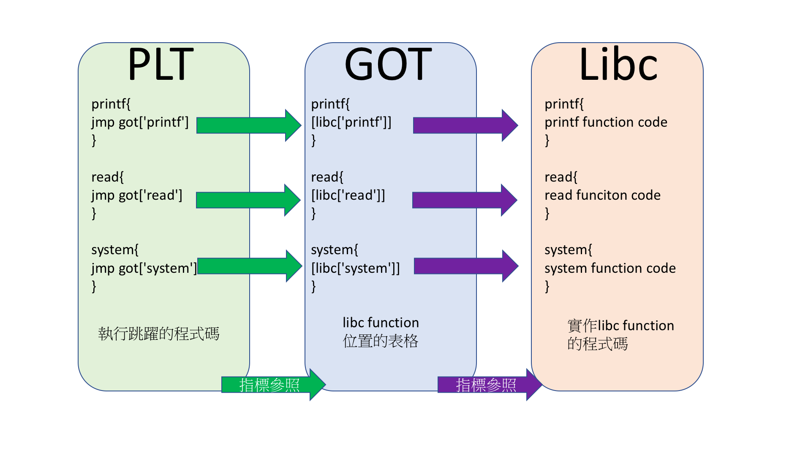

# C in Linux

廖子慶  
2018/03/20 <!-- .element: align="right" -->

---

## Flow

\_\_lib_start_main(main,argc,argv,\_\_libc_csu_init,\_\_libc_csu_fini)


--

# Demo

qira trace

--

# debug tips

## patch alarm

```sh
sed -i 's/alarm/isnan/g' elf
```

## gdb fork follow

```gdb
set follow-fork-mode parent
```

---

# Memory Layout

```sh
cat /proc/`pidof a.out`/maps

00400000-00401000 r-xp 00000000 00:47 9073037                            /ctfbackup/tutorial/control/a.out
00601000-00602000 r--p 00001000 00:47 9073037                            /ctfbackup/tutorial/control/a.out
00602000-00603000 rw-p 00002000 00:47 9073037                            /ctfbackup/tutorial/control/a.out
015f1000-01612000 rw-p 00000000 00:00 0                                  [heap]
7f84f37ae000-7f84f3baf000 rw-p 00000000 00:00 0
7f84f3baf000-7f84f3d6f000 r-xp 00000000 08:01 1836197                    /lib/x86_64-linux-gnu/libc-2.23.so
7f84f3d6f000-7f84f3f6f000 ---p 001c0000 08:01 1836197                    /lib/x86_64-linux-gnu/libc-2.23.so
7f84f3f6f000-7f84f3f73000 r--p 001c0000 08:01 1836197                    /lib/x86_64-linux-gnu/libc-2.23.so
7f84f3f73000-7f84f3f75000 rw-p 001c4000 08:01 1836197                    /lib/x86_64-linux-gnu/libc-2.23.so
7f84f3f75000-7f84f3f79000 rw-p 00000000 00:00 0
7f84f3f79000-7f84f3f9f000 r-xp 00000000 08:01 1836184                    /lib/x86_64-linux-gnu/ld-2.23.so
7f84f418b000-7f84f418e000 rw-p 00000000 00:00 0
7f84f419c000-7f84f419e000 rw-p 00000000 00:00 0
7f84f419e000-7f84f419f000 r--p 00025000 08:01 1836184                    /lib/x86_64-linux-gnu/ld-2.23.so
7f84f419f000-7f84f41a0000 rw-p 00026000 08:01 1836184                    /lib/x86_64-linux-gnu/ld-2.23.so
7f84f41a0000-7f84f41a1000 rw-p 00000000 00:00 0
7ffe7e264000-7ffe7e285000 rw-p 00000000 00:00 0                          [stack]
7ffe7e37c000-7ffe7e37e000 r--p 00000000 00:00 0                          [vvar]
7ffe7e37e000-7ffe7e380000 r-xp 00000000 00:00 0                          [vdso]
ffffffffff600000-ffffffffff601000 r-xp 00000000 00:00 0                  [vsyscall]

```

- segment 位置
- segment rwx 屬性

--

# Program

```sh
00400000-00401000 r-xp 00000000 00:47 9073037                            /ctfbackup/tutorial/control/a.out
00601000-00602000 r--p 00001000 00:47 9073037                            /ctfbackup/tutorial/control/a.out
00602000-00603000 rw-p 00002000 00:47 9073037                            /ctfbackup/tutorial/control/a.out
```

主要三大區段

1. .text(base: 0x0040) : 程式碼
1. .rdata(base: 0x006010) : 唯讀字串
1. .data(base: 0x006020): 全域變數, got table:

--

# Heap

```sh
015f1000-01612000 rw-p 00000000 00:00 0                                  [heap]
```

- base:0x0
- libc 為 ptmalloc
- 由 malloc 產生
- 低位往高位(向下長)
- 有需多高級的 exploit 手法

--

# Stack

```sh
7ffe7e264000-7ffe7e285000 rw-p 00000000 00:00 0                          [stack]
```

- base:0x7ff
- 關鍵 regs: rbp, rsp
- 儲存:rbp, return address, 區域變數
- 由 calloc 產生
- 高位往低位(向上長)

--

# Libc

```sh
7f84f3baf000-7f84f3d6f000 r-xp 00000000 08:01 1836197                    /lib/x86_64-linux-gnu/libc-2.23.so
7f84f3d6f000-7f84f3f6f000 ---p 001c0000 08:01 1836197                    /lib/x86_64-linux-gnu/libc-2.23.so
7f84f3f6f000-7f84f3f73000 r--p 001c0000 08:01 1836197                    /lib/x86_64-linux-gnu/libc-2.23.so
7f84f3f73000-7f84f3f75000 rw-p 001c4000 08:01 1836197                    /lib/x86_64-linux-gnu/libc-2.23.so
7f84f3f75000-7f84f3f79000 rw-p 00000000 00:00 0
```

- base:0x7f
- 實作 c function 的 library
- 跟 Program 相似的分段

---

# Function Call

## rip(rdi, rsi, rdx, rcx, r8, r9, rbp+2\*8, rbp+3\*8)

- printf("%d,%d,%d,%d,%d,%d,%d",a,b,c,d,e,f,g)
- read(0,buf,0x100)

--

# Caller

```asm
;set argv
call foo ;push $rip; jmp foo
```

| addr  | content  |
| ----- | -------- |
| rsp   | ret addr |
| rsp+8 | argv[6]  |

argv[0-5]: rdi,rsi,rdx,rcx,r8,r9

--

# Example

read(0,cmd,10)

```gdb
[----------------------------------registers-----------------------------------]
RAX: 0x7fffffffe480 --> 0x400bb0 (<__libc_csu_init>:    push   r15)
RBX: 0x0
RCX: 0x7ffff7b042c0 (<__write_nocancel+7>:      cmp    rax,0xfffffffffffff001)
RDX: 0xa ('\n')
RSI: 0x7fffffffe480 --> 0x400bb0 (<__libc_csu_init>:    push   r15)
RDI: 0x0
RBP: 0x7fffffffe4a0 --> 0x400bb0 (<__libc_csu_init>:    push   r15)
RSP: 0x7fffffffe410 --> 0x7fffffffe588 --> 0x7fffffffe7ae ("/ctfbackup/tutorial/control/patch")
RIP: 0x400b0c (<main+269>:      call   0x4007d0 <read@plt>)
R8 : 0x7ffff7fe8700 (0x00007ffff7fe8700)
R9 : 0x7
R10: 0x0
R11: 0x246
R12: 0x400870 (<_start>:        xor    ebp,ebp)
R13: 0x7fffffffe580 --> 0x1
R14: 0x0
R15: 0x0
EFLAGS: 0x202 (carry parity adjust zero sign trap INTERRUPT direction overflow)
[-------------------------------------code-------------------------------------]
   0x400aff <main+256>: mov    edx,0xa
   0x400b04 <main+261>: mov    rsi,rax
   0x400b07 <main+264>: mov    edi,0x0
=> 0x400b0c <main+269>: call   0x4007d0 <read@plt>
   0x400b11 <main+274>: lea    rax,[rbp-0x20]
   0x400b15 <main+278>: mov    rdi,rax
   0x400b18 <main+281>: call   0x400840 <atoi@plt>
   0x400b1d <main+286>: mov    DWORD PTR [rbp-0x74],eax
Guessed arguments:
arg[0]: 0x0
arg[1]: 0x7fffffffe480 --> 0x400bb0 (<__libc_csu_init>: push   r15)
arg[2]: 0xa ('\n')
[------------------------------------stack-------------------------------------]
0000| 0x7fffffffe410 --> 0x7fffffffe588 --> 0x7fffffffe7ae ("/ctfbackup/tutorial/control/patch")
0008| 0x7fffffffe418 --> 0x100000000
0016| 0x7fffffffe420 --> 0x0
0024| 0x7fffffffe428 --> 0x0
0032| 0x7fffffffe430 --> 0x0
0040| 0x7fffffffe438 --> 0x603010 --> 0xfbad2488
[------------------------------------------------------------------------------]
Legend: code, data, rodata, value
0x0000000000400b0c in main ()
```

--

# Callee in

```asm
push rbp
mov rbp,rsp
sub rsp,0xXX ;區域變數(now)
```

| addr   | content   |
| ------ | --------- |
| rsp    | local var |
| ...    | ...       |
| rbp    | old \$rbp |
| rbp+8  | ret addr  |
| rbp+16 | argv[6]   |

--

# Example

- init_proc()
- 這個例子沒有區域變數 rsp 不用拉高

```gdb
[-------------------------------------code-------------------------------------]
   0x400976 <handler+16>:       call   0x400790 <puts@plt>
   0x40097b <handler+21>:       mov    edi,0x1
   0x400980 <handler+26>:       call   0x400780 <_exit@plt>
=> 0x400985 <init_proc>:        push   rbp
   0x400986 <init_proc+1>:      mov    rbp,rsp
   0x400989 <init_proc+4>:      mov    rax,QWORD PTR [rip+0x201720]        # 0x6020b0 <stdin@@GLIBC_2.2.5>
   0x400990 <init_proc+11>:     mov    ecx,0x0
   0x400995 <init_proc+16>:     mov    edx,0x2
[------------------------------------stack-------------------------------------]
0000| 0x7fffffffe408 --> 0x400a30 (<main+49>:   mov    edi,0x400c3c)
0008| 0x7fffffffe410 --> 0x7fffffffe588 --> 0x7fffffffe7ae ("/ctfbackup/tutorial/control/patch")
0016| 0x7fffffffe418 --> 0x100000000
0024| 0x7fffffffe420 --> 0x0
0032| 0x7fffffffe428 --> 0x0
0040| 0x7fffffffe430 --> 0x0
0048| 0x7fffffffe438 --> 0x0
0056| 0x7fffffffe440 --> 0xff000000
[------------------------------------------------------------------------------]
Legend: code, data, rodata, value
0x0000000000400985 in init_proc ()
```

--

# Callee out

```asm
leave ;mov rsp,rbp ;(now) pop rbp
ret ;pop $rip
```

| addr   | content   |
| ------ | --------- |
| rsp    | old \$rbp |
| rbp+8  | ret addr  |
| rbp+16 | argv[6]   |

--

# Example

- 這個例子沒有用到 rsp,所以沒有 leave

```gdb
[-------------------------------------code-------------------------------------]
   0x4009f2 <init_proc+109>:    mov    edi,0x3c
   0x4009f7 <init_proc+114>:    call   0x4007c0 <isnan@plt>
   0x4009fc <init_proc+119>:    nop
=> 0x4009fd <init_proc+120>:    pop    rbp
   0x4009fe <init_proc+121>:    ret
   0x4009ff <main>:     push   rbp
   0x400a00 <main+1>:   mov    rbp,rsp
   0x400a03 <main+4>:   sub    rsp,0x90
[------------------------------------stack-------------------------------------]
0000| 0x7fffffffe400 --> 0x7fffffffe4a0 --> 0x400bb0 (<__libc_csu_init>:        push   r15)
0008| 0x7fffffffe408 --> 0x400a30 (<main+49>:   mov    edi,0x400c3c)
0016| 0x7fffffffe410 --> 0x7fffffffe588 --> 0x7fffffffe7ae ("/ctfbackup/tutorial/control/patch")
0024| 0x7fffffffe418 --> 0x100000000
0032| 0x7fffffffe420 --> 0x0
0040| 0x7fffffffe428 --> 0x0
0048| 0x7fffffffe430 --> 0x0
0056| 0x7fffffffe438 --> 0x0
[------------------------------------------------------------------------------]
Legend: code, data, rodata, value
0x00000000004009fd in init_proc ()
```

---

## Library Function Call



--

# PLT

執行跳躍的程式段

```python
from pwn import *
elf=ELF('./elf')
elf.plt

{u'__gmon_start__': 4196448,
 u'__isoc99_scanf': 4196432,
 u'__libc_start_main': 4196320,
 u'_exit': 4196220,
 u'alarm': 4196288,
 u'atoi': 4196416,
 u'fgets': 4196336,
 u'fopen': 4196400,
 u'malloc': 4196368,
 u'printf': 4196272,
 u'puts': 4196240,
 u'read': 4196304,
 u'setvbuf': 4196384,
 u'signal': 4196352,
 u'system': 4196256}
```

--

# Example

```gdb
[-------------------------------------code-------------------------------------]
   0x400780 <_exit@plt>:        jmp    QWORD PTR [rip+0x201892]        # 0x602018
   0x400786 <_exit@plt+6>:      push   0x0
   0x40078b <_exit@plt+11>:     jmp    0x400770
=> 0x400790 <puts@plt>: jmp    QWORD PTR [rip+0x20188a]        # 0x602020
 | 0x400796 <puts@plt+6>:       push   0x1
 | 0x40079b <puts@plt+11>:      jmp    0x400770
 | 0x4007a0 <system@plt>:       jmp    QWORD PTR [rip+0x201882]        # 0x602028
 | 0x4007a6 <system@plt+6>:     push   0x2
 |->   0x400796 <puts@plt+6>:   push   0x1
       0x40079b <puts@plt+11>:  jmp    0x400770
       0x4007a0 <system@plt>:   jmp    QWORD PTR [rip+0x201882]        # 0x602028
       0x4007a6 <system@plt+6>: push   0x2
                                                                  JUMP is taken
[------------------------------------stack-------------------------------------]
0000| 0x7fffffffe408 --> 0x400a3a (<main+59>:   mov    edi,0x400c53)
0008| 0x7fffffffe410 --> 0x7fffffffe588 --> 0x7fffffffe7ae ("/ctfbackup/tutorial/control/a.out")
0016| 0x7fffffffe418 --> 0x100000000
0024| 0x7fffffffe420 --> 0x0
0032| 0x7fffffffe428 --> 0x0
0040| 0x7fffffffe430 --> 0x0
0048| 0x7fffffffe438 --> 0x0
0056| 0x7fffffffe440 --> 0xff000000
[------------------------------------------------------------------------------]
Legend: code, data, rodata, value
0x0000000000400790 in puts@plt ()
```

--

# GOT

紀錄 libc function 位置的表

```python
from pwn import *
elf=ELF('./elf')
elf.got

{u'__gmon_start__': 6299640,
 u'__isoc99_scanf': 6299776,
 u'__libc_start_main': 6299720,
 u'_exit': 6299672,
 u'alarm': 6299704,
 u'atoi': 6299768,
 u'fgets': 6299728,
 u'fopen': 6299760,
 u'malloc': 6299744,
 u'printf': 6299696,
 u'puts': 6299680,
 u'read': 6299712,
 u'setvbuf': 6299752,
 u'signal': 6299736,
 u'stderr': 6299840,
 u'stdin': 6299824,
 u'stdout': 6299808,
 u'system': 6299688}
```

--

# Example

alarm 的 got

```gdb
gdb-peda$ x/10gx 6299704
0x602038:       0x00007ffff7ad9200      0x00007ffff7b04250
0x602048:       0x00007ffff7a2d740      0x00007ffff7a7aad0
0x602058:       0x00007ffff7a423c0      0x00007ffff7a91130
0x602068:       0x00007ffff7a7ce70      0x00007ffff7a7ad70
0x602078:       0x00007ffff7a43e80      0x00007ffff7a784d0
```

--

# Libc

實作 function 的程式碼

alarm 的實作

```gdb
gdb-peda$ disass 0x00007ffff7ad9200
Dump of assembler code for function alarm:
   0x00007ffff7ad9200 <+0>:     mov    eax,0x25
   0x00007ffff7ad9205 <+5>:     syscall
   0x00007ffff7ad9207 <+7>:     cmp    rax,0xfffffffffffff001
   0x00007ffff7ad920d <+13>:    jae    0x7ffff7ad9210 <alarm+16>
   0x00007ffff7ad920f <+15>:    ret
   0x00007ffff7ad9210 <+16>:    mov    rcx,QWORD PTR [rip+0x2f7c61]        # 0x7ffff7dd0e78
   0x00007ffff7ad9217 <+23>:    neg    eax
   0x00007ffff7ad9219 <+25>:    mov    DWORD PTR fs:[rcx],eax
   0x00007ffff7ad921c <+28>:    or     rax,0xffffffffffffffff
   0x00007ffff7ad9220 <+32>:    ret
End of assembler dump.
```

---

# 課堂練習

```c
#include <stdio.h>
#include <string.h>
#include <unistd.h>
#include <stdbool.h>
#include <stdlib.h>
#include <signal.h>
#include <time.h>
#define TIMEOUT 60

void handler(int signum){
    puts("Timeout");
    _exit(1);
}
void init_proc(){
    setvbuf(stdin,0,2,0);
    setvbuf(stdout,0,2,0);
    setvbuf(stderr,0,2,0);
    signal(SIGALRM,handler);
    alarm(TIMEOUT);
}

int main(int argc, char *argv[])
{
    init_proc();
    puts("get shell to cat flag2");
    system("ls");

    FILE *fp;
    fp=fopen("flag1.txt","r");
    char *flag;
    flag=malloc(100);
    fgets(flag,100,fp);

    char cmd[10];
    long long (*func)();
    long long args[6];
    printf("cmd in %p\n",&cmd);
    printf("flag in %p\n",flag);
    while(1){
        puts("0. set rdi");
        puts("1. set rsi");
        puts("2. set rdx");
        puts("3. set rcx");
        puts("4. set r8");
        puts("5. set r9");
        puts("6. call function");
        printf("choose:");
        read(0,cmd,10);
        int idx=atoi(cmd);
        printf("value:");
        long long value;
        scanf("%lld",&value);
        if (idx==6) {
            func=(long long (*)()) value;
            (long long)(*func)(args[0],args[1],args[2],args[3],args[4],args[5]);
        }
        if (idx>=0&&idx<=5){
            args[idx]=value;
        }
    }
    return 0;
}
```

[control.c](https://drive.google.com/open?id=1W4uOgJgGw85r7cYyYtfMQSskJGkMxrYE)

[control](https://drive.google.com/open?id=1Gb6hAexK-VZh6d3fEMGGuKmAIqrd9cvL)

--

# 課堂練習

```sh
nc sv.duckll.tw 8888
```

拿到第一個 flag  
Tips: printf, flag

--

# 回家作業

```sh
nc sv.duckll.tw 8888
```

拿到第二個 flag  
Target: system("sh")  
Tips: read, cmd position  
至少有 3 種解法

---

# END
