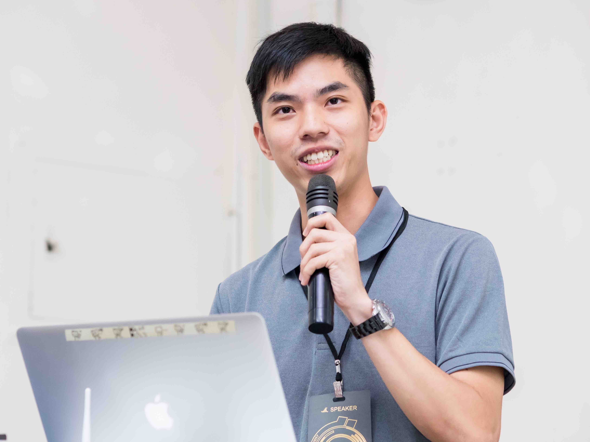

# 你也想成為駭客嗎？

 <!-- .element: width="30%" -->

2018/07/13 NTHU <!-- .element: align="left" -->

DuckLL <!-- .element: align="right" -->

--

# 關於我

- 名字: 廖子慶
- ID: DuckLL
- 部落格: http://www.duckll.tw

 <!-- .element: width="50%" -->

--

# 今天的重點

## 1. 駭客 v.s. 資訊安全

## 2. 資訊安全領域介紹

## 3. 如何成為一個駭客

---

--

# 你想的駭客?

<iframe width="800" height="600" src="https://www.youtube.com/embed/iI9IygdZhvo?start=40" frameborder="0" allow="autoplay; encrypted-media" allowfullscreen></iframe>

--

# 現實中的駭客

Geohot

--

# 駭客

對電腦科學、程式和設計方面具高度理解的人

--

# 黑帽駭客

通常指怪客(Cracker)，以利益導向  
專門尋找系統或程式漏洞，入侵網站、竊取個人資料  
牟取不當的利益等為他們的目標｡

--

# 白帽駭客

資訊安全人員，具有駭客的知識與能力，了解駭客的手法  
扮演正義的一方，能夠修補網站漏洞及程式漏洞，阻絕黑帽駭客的攻擊｡

--

# 資訊安全六大領域

## 1. 密碼學

## 2. 網頁安全

## 3. 逆向工程

## 4. 程式安全

## 5. 網路安全

## 6. 數位鑑識

---

# 密碼學

 <!-- .element: width="50%" -->

# 設計複雜的數學難題 <!-- .element: class="fragment" -->

--

# 資訊安全的基石

# 生活上到處都是

- Wi-Fi
- HTTPS
- Line
- 壓縮密碼
- ......

---

# 網頁安全

 <!-- .element: width="50%" -->

# 找網站上的漏洞 <!-- .element: class="fragment" -->

--

--

# 網頁的優勢

- 實用、炫炮
- 跨平台
- 馬上能讓世界看到

# [SeeDcard](http://seedcard.duckll.tw) <!-- .element: target="_blank" -->

--

# 常見的攻擊

- 偷資料、改資料
- 竄改頁面
- 取得付費資源

--

# DEMO

# 跨站腳本攻擊(XSS)

---

# 逆向工程

 <!-- .element: width="40%" -->

# 分析程式的邏輯 <!-- .element: class="fragment" -->

--

# 常見的利用

- 商業軟體破解
- 付費遊戲破解
- 遊戲外掛
- 二次創作

--

# 講個故事

- 揭露遊戲更新

--

# DEMO

--

# [PIKA_V](https://www.dropbox.com/s/wxjzwl4lcz6inb0/PIKA_V_patch.exe?dl=1) <!-- .element: target="_blank" -->

- HxD
- 7E0233C0->90909090

--

# [Beat_Stomper](https://www.dropbox.com/s/7n9l3s6nksjfw8b/beat_ptach.apk?dl=1) <!-- .element: target="_blank" -->

- apktool
- Reflector
- reflexil

---

# 程式安全

 <!-- .element: width="60%" -->

# 尋找程式上的漏洞並且攻擊 <!-- .element: class="fragment" -->

--

跟逆向工程的差異

# 不能更改程式

# 但要讓程式受你控制

--

# 極具困難與挑戰

# 生活中的例子

- PS3 破解
- iOS JB
- Android Root

---

# 網路安全

 <!-- .element: width="50%" -->

# 防火牆、資料傳輸安全 <!-- .element: class="fragment" -->

--

# 看我如何破解 iTaiwan

--

---

# 數位鑑識

 <!-- .element: width="50%" -->

# 還原資訊、建立情報 <!-- .element: class="fragment" -->

--

# 常見的範圍

- 還原刪除的檔案
- 還原壞掉的設備
- 資訊情報檢索
- 診斷惡意行為

---

# 為什麼我會踏進資安圈

--

 <!-- .element: width="80%" -->

--

# 重大里程

- The WarGame 駭客訓練基地
- 參加台灣駭客年會
- 參加 RAT 社團
- 台灣資安高峰會志工
- AIS3 學員
- TDOH-conf 講師

---

# 資安活動、社群

--

# [高中職生資安研習營](https://www.facebook.com/%E9%AB%98%E4%B8%AD%E8%81%B7%E7%94%9F%E8%B3%87%E5%AE%89%E7%A0%94%E7%BF%92%E7%87%9F-455550404836569/) <!-- .element: target="_blank" -->

 <!-- .element: width="30%" -->

- 各縣市資安入門活動
- Summer Camp 暑訓營
- BreakALL CTF

--

# [UCCU](https://www.facebook.com/UCCU.Hacker/) <!-- .element: target="_blank" -->

 <!-- .element: width="50%" -->

 <!-- .element: width="50%" -->

- 南部最大資安社群
- 每個月會有一次[聚會](https://uccu.kktix.cc/) <!-- .element: target="_blank" -->
- 星期五晚上8點[Youtube直播](https://www.youtube.com/channel/UCGZ7IeseXw2UTpeiW3KW4_A) <!-- .element: target="_blank" -->

--

# [BambooFox](https://www.facebook.com/NCTUCSC/) <!-- .element: target="_blank" -->

 <!-- .element: width="50%" -->

 <!-- .element: width="50%" -->

- 交大網路安全策進會
- [官方網站](https://bamboofox.cs.nctu.edu.tw/)
    - 歷年課程、CTF
- [官方blog](https://bamboofox.github.io/)
    - 資安文章、Writeup

--

# [TDOH](https://www.facebook.com/tdohacker/) <!-- .element: target="_blank" -->

 <!-- .element: width="50%" -->

 <!-- .element: width="51%" -->

- 最大資安學生社群
- 資安新聞及事件週報
- 北中南 PIPE 聚會
- 輔導高中職社團
- TDOH-conf

--

 <!-- .element: width="50%" -->

TDOH-conf 2017 講師

--

# [HITCON](https://www.facebook.com/HITCON/) <!-- .element: target="_blank" -->

 <!-- .element: width="50%" -->

 <!-- .element: width="70%" -->

- 台灣駭客年會
- 有適合新手的議程
- 認識社群的好機會

--

 <!-- .element: width="80%" -->

HITCON Knowledge Base 投稿領賞

---

# CTF

# Capture The Flag <!-- .element: class="fragment" -->

--

# 資訊安全競賽

利用駭客技能取得特定的文字(FLAG)  
並且送出得到分數

- 入侵主機
- 取得權限
- 破解密碼
- 破解程式
- 撰寫程式
- 隱寫術

--

# CTF 帶來的好處

- 讓你瞭解更多的技術
- 活化你的腦袋
- 讓你成為知名駭客
- 認識更多的駭客朋友
- 學習別人的技術(Writeup)
- 獎金、獎品

--

IBM CTF 冠軍

--

# DEMO

# [login](https://seedcard.duckll.tw/login.php) <!-- .element: target="_blank" -->

---

# [Got You PW](https://gotyour.pw) <!-- .element: target="_blank" -->

- 資源整理大集合

---

# [台灣少年駭客營](https://sites.google.com/view/thitcamp-2018/%E8%AA%B2%E7%A8%8B%E8%B3%87%E8%A8%8A?authuser=0) <!-- .element: target="_blank" -->

--

# Q & A

--

# END

謝謝大家
