# Be a Tool Man

DuckLL  
2019/09/19 <!-- .element: align="right" -->

--

# Outline

- What's in my mac
- Productivity Services

--

# Before Start...

## [AlternativeTo](https://alternativeto.net)

---

# What's in my mac

--

## [homebrew](https://brew.sh/)

- software management
  - save time
  - same interface
  - list apps
- `brew cask install [software name]`

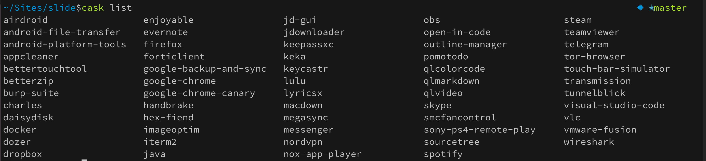

--

# BetterTouchTool

- hotkeys
- window snapping

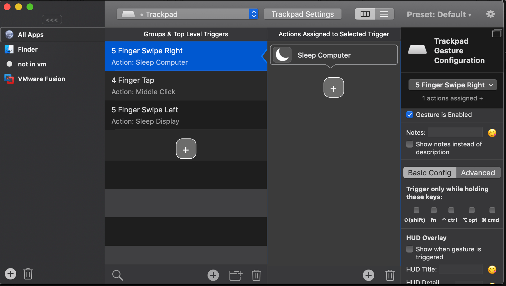 <!-- .element: width="60%" -->

--

# BetterZip

- preview compressed file

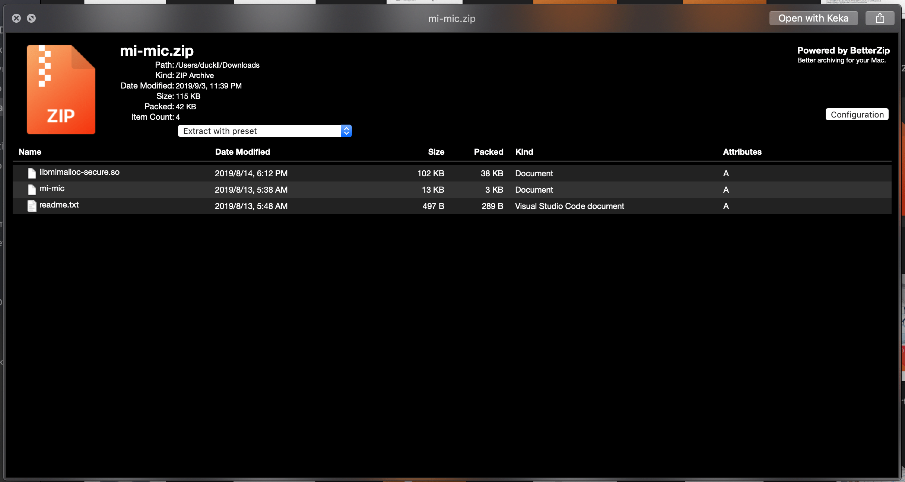 <!-- .element: width="80%" -->

--

# Keka

- compress/decompress file

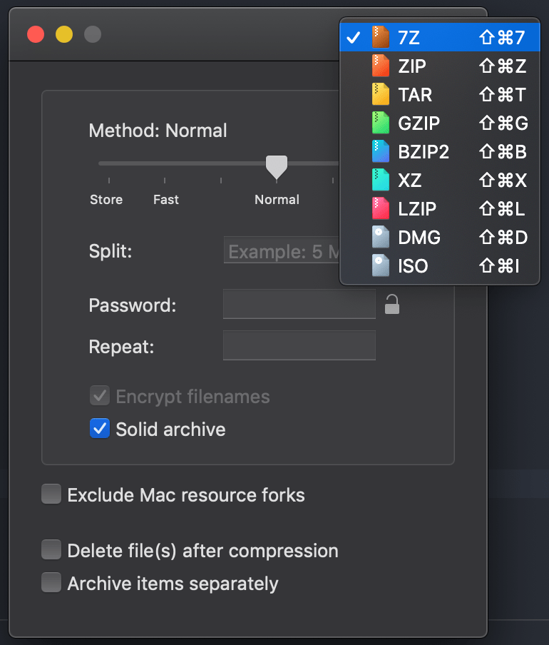 <!-- .element: width="30%" -->

--

# JDownloader

- online storage(Mega,GDrive...)
- pipeline

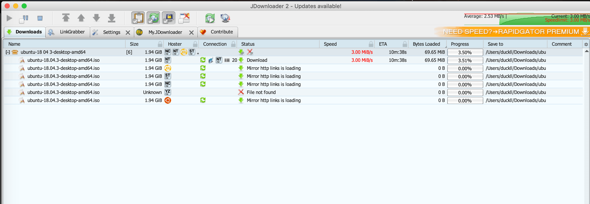

--

# Visual Studio Code

- text editor
- markdown editor
- context search

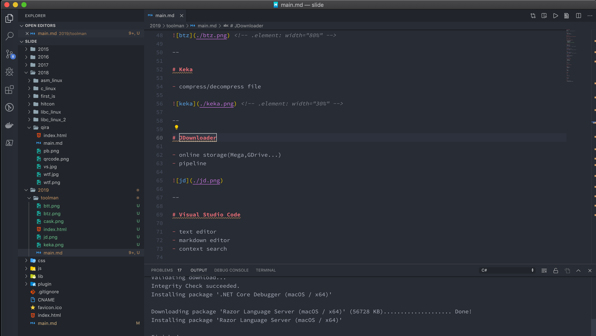 <!-- .element: width="60%" -->

--

# VLC

- media player

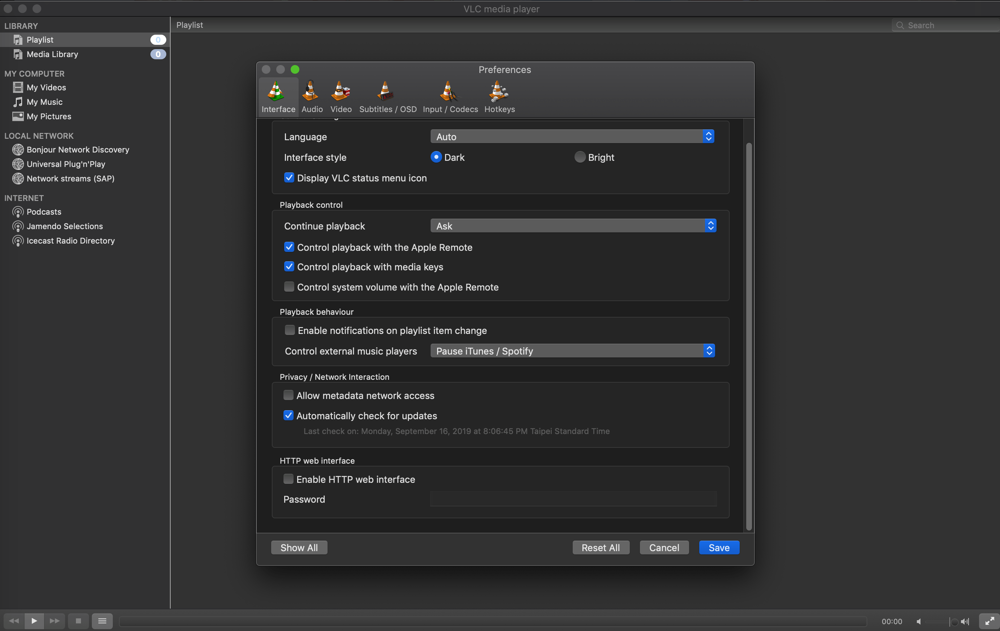 <!-- .element: width="60%" -->

--

# ImageOptim

- compress images

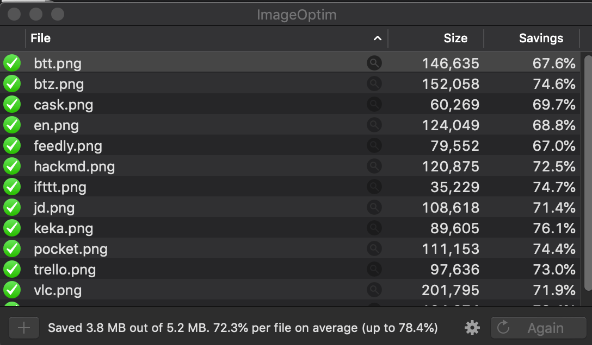

---

# Productivity Services

--

# HackMD

- markdown editor
- notebook

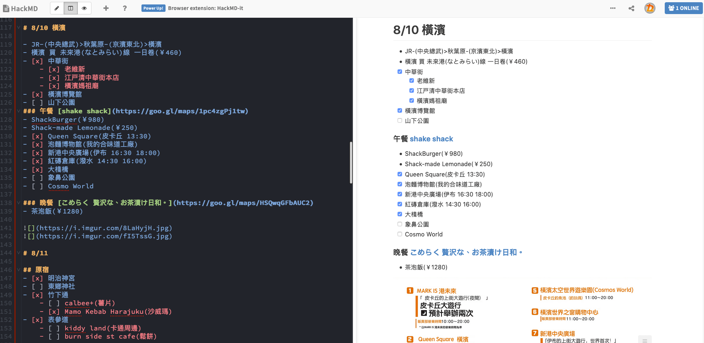 <!-- .element: width="80%" -->

--

# Trello

- kanban
- todo list

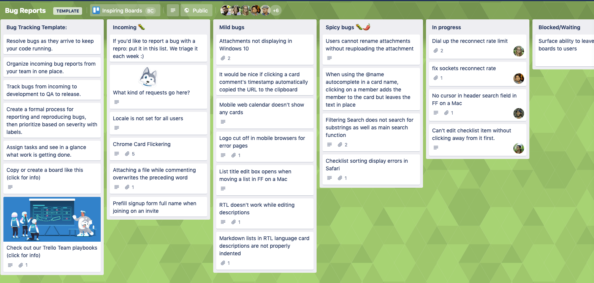 <!-- .element: width="80%" -->

--

# Feedly

- RSS

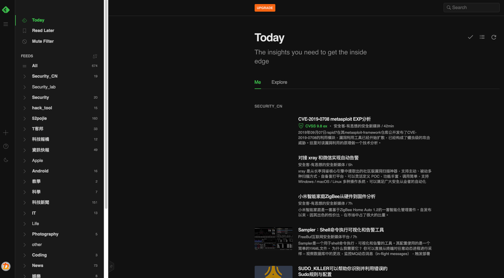 <!-- .element: width="70%" -->

--

# Pocket

- read it later

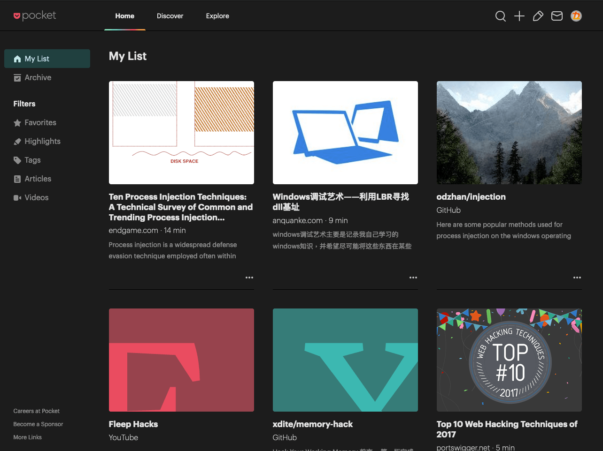 <!-- .element: width="60%" -->

--

# Evernote

- save great post

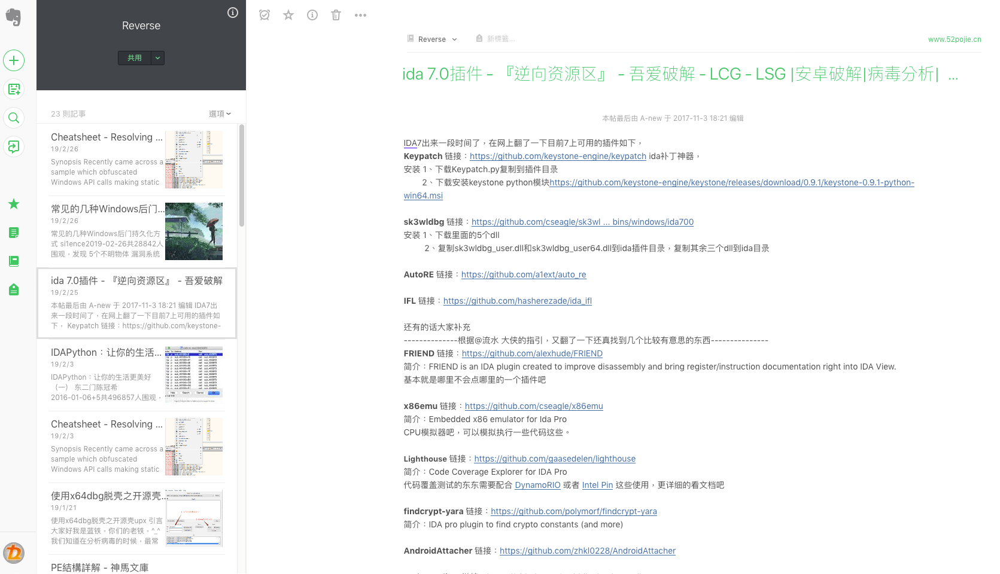 <!-- .element: width="60%" -->

--

# IFTTT

- if this than that
- build bot without program

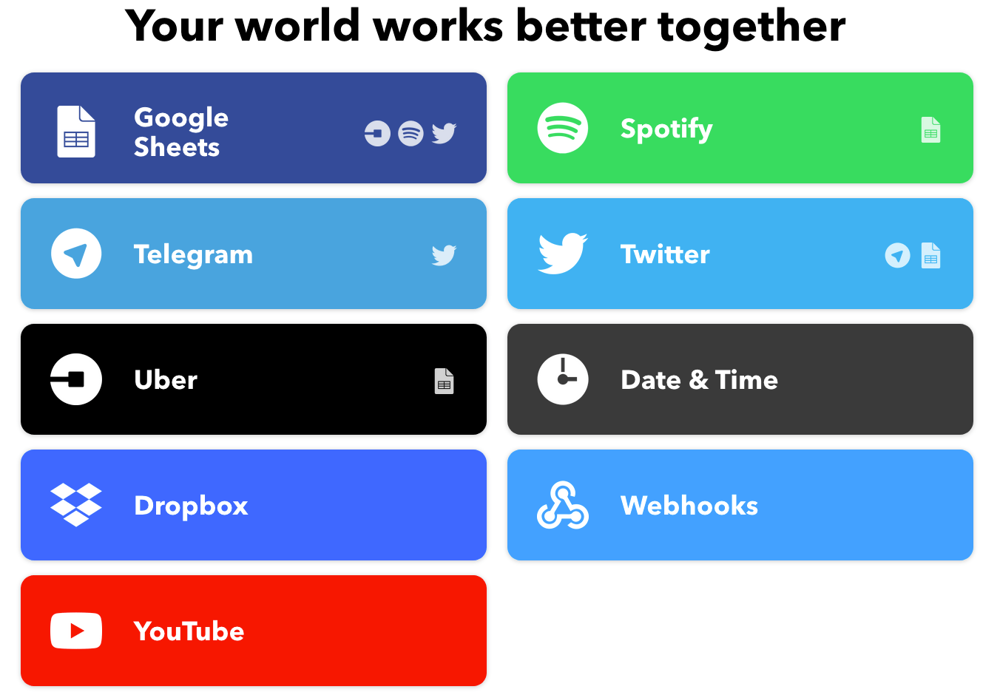 <!-- .element: width="60%" -->
